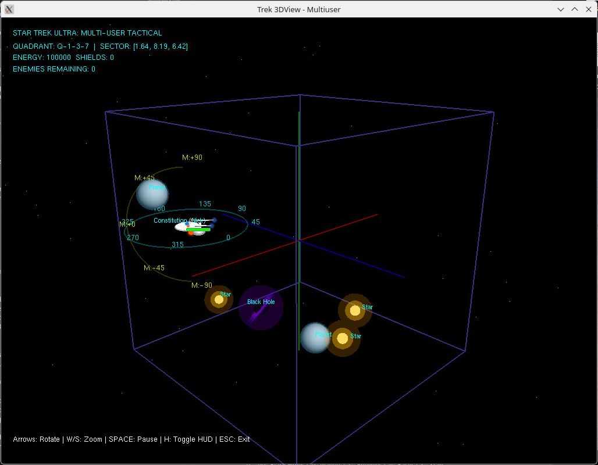
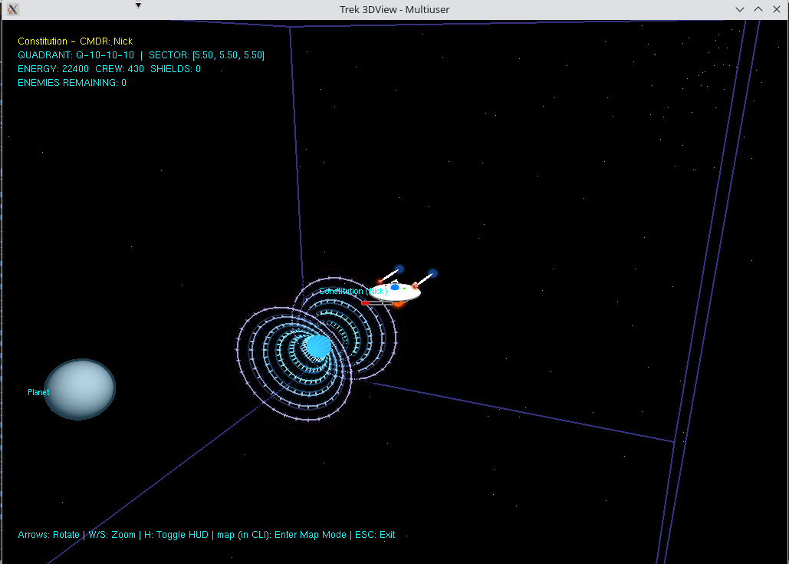
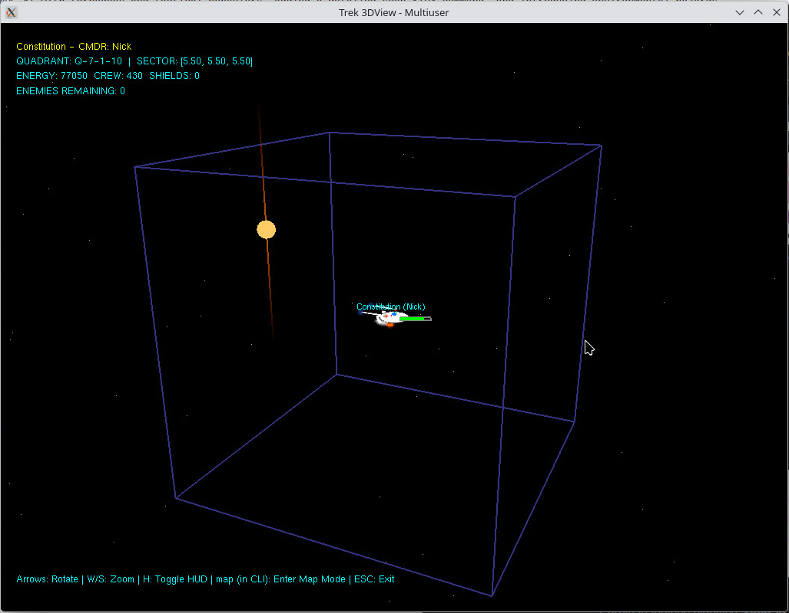
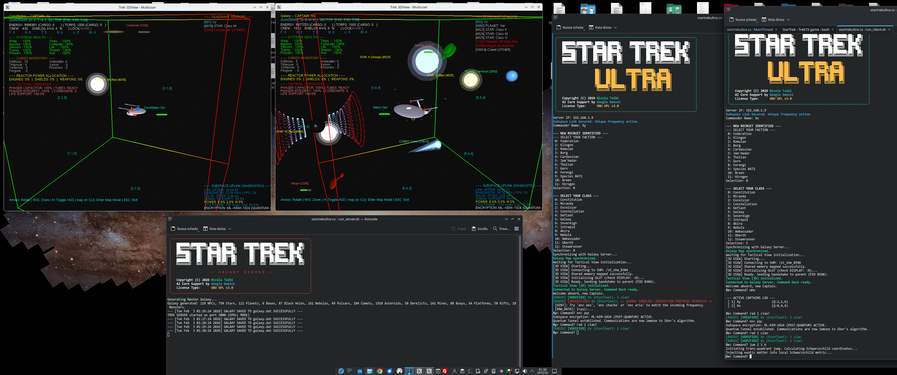
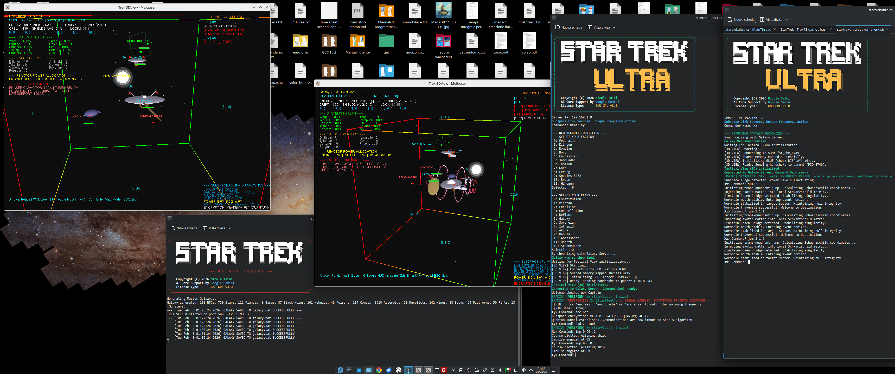

# Star Trek Ultra: 3D Multi-User Client-Server Edition
## Star Trek Day, 8 settembre 2026, 60 anni dalla prima messa in onda della serie originale nel 1966.
**Persistent Galaxy Tactical Navigation & Combat Simulator**

<table>
  <tr>
    <td></td>
    <td></td>
  </tr>
  <tr>
    <td></td>
    <td></td>
  </tr>
  <tr>
    <td></td>
    <td></td>
  </tr>
</table>

Star Trek Ultra è un simulatore spaziale avanzato che unisce la profondità strategica dei classici giochi testuali "Trek" anni '70 con un'architettura moderna Client-Server e una visualizzazione 3D accelerata hardware.

---

## 🚀 Guida Rapida all'Avvio (Quick Start)

### 1. Installazione Dipendenze (Linux)
```bash
# Ubuntu / Debian
sudo apt-get install build-essential freeglut3-dev libglu1-mesa-dev libglew-dev libssl-dev

# Fedora / Red Hat
sudo dnf groupinstall "Development Tools"
sudo dnf install freeglut-devel mesa-libGLU-devel glew-devel openssl-devel
```

### 2. Compilazione
Compila il progetto per generare gli eseguibili aggiornati:
```bash
make
```

### 3. Guida Operativa ai Comandi e Crittografia Subspaziale

Il ponte di comando di Star Trek Ultra opera tramite un'interfaccia a riga di comando (CLI) ad alta precisione. Oltre ai comandi di navigazione e combattimento, il simulatore implementa un sofisticato sistema di **Guerra Elettronica** basato su crittografia reale.

#### 🛰️ Comandi di Navigazione Avanzata e Utility
*   `nav <H> <M> <W> [F]`: **Warp Navigation**. Rotta di curvatura verso coordinate relative. `H`: Heading (0-359), `M`: Mark (-90/+90), `W`: Distanza in quadranti, `F`: Fattore Warp opzionale (1.0 - 9.9).
*   `imp <H> <M> <S>`: **Impulse Drive**. Navigazione sub-luce nel settore attuale. `S`: Velocità in percentuale (1-100%). Usare `imp <S>` per cambiare solo velocità.
*   `jum <Q1> <Q2> <Q3>`: **Wormhole Jump**. Genera un tunnel spaziale verso un quadrante lontano. Richiede **5000 energia e 1 Cristallo di Dilithium**.
*   `apr <ID> [DIST]`: **Automatic Approach**. Il pilota automatico intercetta l'oggetto specificato alla distanza desiderata (default 2.0). Funziona in tutta la galassia per navi e comete.
*   `cha`: **Chase Target**. Insegue attivamente il bersaglio attualmente agganciato (`lock`).
*   `rep <ID>`: **Repair System**. Avvia le riparazioni su un sottosistema (1: Warp, 2: Impulso, 3: Sensori, 4: Faser, 5: Siluri, ecc.).
*   `inv`: **Inventory Report**. Elenco dettagliato delle risorse in stiva (Dilithio, Tritanio, Gas, ecc.).
*   `dam`: **Damage Report**. Stato dettagliato dell'integrità dello scafo e dei sistemi.
*   `cal <Q1> <Q2> <Q3>`: **Warp Calculator**. Calcola il vettore verso il centro di un quadrante distante.
*   `cal <Q1> <Q2> <Q3> <X> <Y> <Z>`: **Pinpoint Calculator**. Calcola il vettore verso coordinate di settore precise `[X, Y, Z]` in un quadrante distante. Fornisce tempi di arrivo e suggerisce il comando `nav` esatto da copiare.
*   `ical <X> <Y> <Z>`: **Impulse Calculator**. Fornisce la soluzione di navigazione completa per coordinate di settore precise [0.0 - 10.0], incluso il tempo di percorrenza in base all'attuale potenza dei motori.
*   `who`: **Captains Registry**. Elenca tutti i comandanti attualmente attivi nella galassia, i loro ID di tracciamento e la posizione attuale. Fondamentale per identificare alleati o potenziali predatori prima di entrare in un settore.
*   `sta`: **Status Report**. Diagnostica completa dei sistemi, inclusi i livelli di energia, integrità hardware e ripartizione della potenza.
*   `hull`: **Duranium Reinforcement**. Se possiedi **100 unità di Duranio** in stiva, questo comando applica una placcatura rinforzata allo scafo (+500 HP di scudo fisico), visibile in oro nell'HUD.

#### 🛡️ Crittografia Tattica: Le "Frequenze" di Comunicazione
In Star Trek Ultra, la crittografia non è solo sicurezza, ma una **scelta di frequenza operativa**. Ogni algoritmo agisce come una banda di comunicazione separata.

*   **Identità e Firma (Ed25519)**: Ogni pacchetto radio è firmato digitalmente. Se ricevi un messaggio con tag **`[VERIFIED]`**, hai la certezza matematica che provenga dal capitano dichiarato e che non sia stato alterato da sensori nemici o fenomeni spaziali.
*   **Frequenze Crittografiche (`enc <TIPO>`)**:
    *   **AES (`enc aes`)**: Lo standard di flotta bilanciato. Sicuro e ottimizzato per l'hardware moderno.
    *   **PQC (`enc pqc`)**: **Crittografia Post-Quantistica (ML-KEM)**. Rappresenta la difesa definitiva contro i computer quantistici dei Borg o di civiltà temporalmente avanzate. È il protocollo più sicuro disponibile.
    *   **ChaCha (`enc chacha`)**: Ultra-veloce, ideale per comunicazioni rapide in condizioni di instabilità subspaziale.
    *   **Camellia (`enc camellia`)**: Protocollo standard dell'Impero Romulano, ottimizzato per resistere ad attacchi di forza bruta.
    *   **ARIA (`enc aria`)**: Standard utilizzato dall'Alleanza Klingon per le operazioni di coalizione.
    *   **IDEA / CAST5**: Protocolli spesso utilizzati da gruppi di resistenza (Maquis) o mercenari per sfuggire al monitoraggio standard della Flotta.
    *   **OFF (`enc off`)**: Comunicazione in chiaro. Rischiosa, ma utile per chiamate di soccorso universali leggibili da chiunque.

**Implicazione Tattica**: Se una flotta alleata decide di operare su "Frequenza ARIA", ogni membro deve impostare `enc aria`. Chi rimane su AES vedrà solo rumore statico (**`<< SIGNAL DISTURBED >>`**), permettendo comunicazioni sicure e segrete anche in settori affollati.
```bash
./run_server.sh
```

### 4. Avvio del Client
In un altro terminale, lancia il client:
```bash
./run_client.sh
```
**Flusso di accesso:**
1.  **Server IP:** Inserisci l'indirizzo del server.
2.  **Handshake:** Il client valida la Master Key. Se errata, esce immediatamente per sicurezza.
3.  **Identificazione:** Solo se il link è sicuro, ti verrà chiesto il **Commander Name**.
4.  **Configurazione:** Se è la tua prima volta, sceglierai Fazione e Classe della nave.

---

## ⚙️ Configurazione Avanzata e Modding

Il gameplay è interamente personalizzabile tramite il file di configurazione centralizzato **`include/game_config.h`**.
Modificando questo file e ricompilando con `make`, è possibile alterare le regole della fisica e del combattimento del proprio server.

Parametri configurabili includono:
*   **Limiti Risorse:** `MAX_ENERGY_CAPACITY`, `MAX_TORPEDO_CAPACITY`.
*   **Bilanciamento Danni:** `DMG_PHASER_BASE` (potenza faser), `DMG_TORPEDO` (danno siluri).
*   **Distanze di Interazione:** `DIST_MINING_MAX` (raggio minerario), `DIST_BOARDING_MAX` (raggio teletrasporto per arrembaggio).
*   **Eventi:** `TIMER_SUPERNOVA` (durata del countdown catastrofico).

Questo permette agli amministratori di creare varianti del gioco (es. *Hardcore Survival* con poche risorse o *Arcade Deathmatch* con armi potenziate).

---

### 🔐 Architettura di Sicurezza: Protocollo "Dual-Layer"

Star Trek Ultra implementa un modello di sicurezza di livello militare, progettato per garantire la segretezza delle comunicazioni anche in ambienti multi-squadra ostili.

#### 1. Il Concetto
Il sistema utilizza due livelli di crittografia distinti per bilanciare accessibilità e isolamento tattico:

1.  **Master Key (Shared Secret - KEK):**
    *   **Ruolo:** Funziona come **Key Encryption Key (KEK)**. Non cifra direttamente i dati di gioco, ma protegge il tunnel in cui viene scambiata la chiave di sessione.
    *   **Verifica di Integrità:** Il sistema utilizza una "Firma Magica" di 32 byte (`HANDSHAKE_MAGIC_STRING`). Durante l'aggancio, il server tenta di decifrare questa firma usando la Master Key fornita.
    *   **Rigore Tattico:** Se anche un solo bit della Master Key differisce (es. "ciao" vs "ciao1"), la firma risulterà corrotta. Il server rileverà l'anomalia e **troncherà istantaneamente la connessione TCP**, emettendo un `[SECURITY ALERT]` nei log.
    *   **Impostazione:** Viene richiesta all'avvio dagli script `run_server.sh` e `run_client.sh`.

2.  **Session Key (Unique Ephemeral Key):**
    *   **Ruolo:** Chiave crittografica casuale a 256-bit generata dal client per ogni sessione.
    *   **Isolamento Totale:** Una volta convalidata la Master Key, il server e il client passano alla Session Key. Questo garantisce che **ogni giocatore/squadra sia sintonizzato su una frequenza crittografica diversa**, rendendo i dati di una squadra inaccessibili alle altre anche se condividono lo stesso server.

#### 2. Guida all'Avvio Sicuro

Per garantire che la sicurezza sia attiva, utilizzare sempre gli script bash forniti invece di lanciare direttamente gli eseguibili.

**Avvio del Server:**
```bash
./run_server.sh
# Ti verrà chiesto di inserire una Master Key segreta (es. "DeltaVega47").
# Questa chiave dovrà essere comunicata a tutti i giocatori autorizzati.
```

**Avvio del Client:**
```bash
./run_client.sh
# Inserisci la STESSA Master Key impostata sul server.
# Il sistema confermerà: "Secure Link Established. Unique Frequency active."
```

#### 3. Comandi di Crittografia in Gioco
Una volta connessi, la sicurezza è attiva ma trasparente. I capitani possono scegliere l'algoritmo di cifratura tattica (il "sapore" della crittografia) usando il comando `enc`:

*   `enc aes`: Attiva AES-256-GCM (Standard della Flotta).
*   `enc chacha`: Attiva ChaCha20-Poly1305 (Alta velocità).
*   `enc off`: Disattiva la cifratura (Traffico in chiaro, sconsigliato).

*Nota: Se due giocatori usano algoritmi diversi (es. uno AES e l'altro ChaCha), non potranno leggere i messaggi radio l'uno dell'altro, vedendo solo "rumore statico". Questo obbliga le squadre a coordinare le frequenze di comunicazione.*

---

## 🛠️ Architettura del Sistema e Dettagli Costruttivi

Il gioco è basato sull'architettura **Subspace-Direct Bridge (SDB)**, un modello di comunicazione ibrido progettato per eliminare i colli di bottiglia tipici dei simulatori multiplayer in tempo reale.

### Il Modello Subspace-Direct Bridge (SDB)
Questa architettura d'avanguardia risolve il problema della latenza e del jitter tipici dei giochi multiplayer intensivi, disaccoppiando completamente la sincronizzazione della rete dalla fluidità della visualizzazione. Il modello SDB trasforma il client in un **Relè Tattico Intelligente**, ottimizzando il traffico remoto e azzerando la latenza locale.

1.  **Subspace Channel (TCP/IP Binary Link)**:
    *   **Ruolo**: Sincronizzazione autoritativa dello stato galattico.
    *   **Tecnologia**: Protocollo binario proprietario con **Interest Management** dinamico. Il server calcola quali oggetti sono visibili al giocatore e invia solo i dati necessari, riducendo l'uso della banda fino all'85%.
    *   **Caratteristiche**: Implementa pacchetti a lunghezza variabile e packing binario (`pragma pack(1)`) per eliminare il padding e massimizzare l'efficienza sui canali remoti.

2.  **Direct Bridge (POSIX Shared Memory Link)**:
    *   **Ruolo**: Interfaccia a latenza zero tra logica locale e motore grafico.
    *   **Tecnologia**: Segmento di memoria condivisa (`/dev/shm`) mappato direttamente negli spazi di indirizzamento di Client e Visualizzatore.
    *   **Efficienza**: Utilizza un approccio **Zero-Copy**. Il Client scrive i dati ricevuti dal server direttamente nella SHM; il Visualizzatore 3D li consuma istantaneamente. La sincronizzazione è garantita da semafori POSIX e mutex, permettendo al motore grafico di girare a 60+ FPS costanti, applicando **Linear Interpolation (LERP)** per compensare i buchi temporali tra i pacchetti di rete.

#### 🔄 Pipeline di Flusso del Dato (Propagazione Tattica)
L'efficacia del modello SDB è visibile osservando il viaggio di un singolo aggiornamento (es. il movimento di un Falco da Guerra Romulano):
1.  **Server Tick (Logic)**: Il server calcola la nuova posizione globale del nemico e aggiorna l'indice spaziale.
2.  **Subspace Pulse (Network)**: Il server serializza il dato nel `PacketUpdate`, lo tronca per includere solo gli oggetti nel quadrante del giocatore e lo invia via TCP.
3.  **Client Relay (Async)**: Il thread `network_listener` del client riceve il pacchetto, valida il `Frame ID` e scrive le coordinate nella **Shared Memory**.
4.  **Direct Bridge Signal (IPC)**: Il client incrementa il semaforo `data_ready`.
5.  **Viewer Wake-up (Rendering)**: Il visualizzatore esce dallo stato di *wait*, acquisisce il mutex, copia le nuove coordinate come `target` e avvia il calcolo LERP per far scivolare fluidamente il vascello verso la nuova posizione durante i successivi frame grafici.

Grazie a questa pipeline, i comandi via terminale viaggiano nel "Subspazio" con la sicurezza del protocollo TCP, mentre la vista tattica sul ponte rimane stabile, fluida e priva di scatti, indipendentemente dalla qualità della connessione internet.

### 1. Il Server Galattico (`trek_server`)
È il "motore" del gioco. Gestisce l'intero universo di 1000 quadranti.
*   **Logica Modulare**: Diviso in moduli (`galaxy.c`, `logic.c`, `net.c`, `commands.c`) per garantire manutenibilità e thread-safety.
*   **Spatial Partitioning**: Utilizza un indice spaziale 3D (Grid Index) per la gestione degli oggetti. Questo permette al server di scansionare solo gli oggetti locali al giocatore, garantendo prestazioni costanti ($O(1)$) indipendentemente dal numero totale di entità nella galassia.
*   **Persistenza**: Salva lo stato dell'intero universo, inclusi i progressi dei giocatori, in `galaxy.dat` con controllo di versione binaria.

### 2. Il Ponte di Comando (`trek_client`)
Il `trek_client` rappresenta il nucleo operativo dell'esperienza utente, agendo come un sofisticato orchestratore tra l'operatore umano, il server remoto e il motore di rendering locale.

*   **Architettura Multi-Threaded**: Il client gestisce simultaneamente diverse pipeline di dati:
    *   Un thread dedicato (**Network Listener**) monitora costantemente il *Subspace Channel*, processando i pacchetti in arrivo dal server senza bloccare l'interfaccia.
    *   Il thread principale gestisce l'input utente e il feedback immediato sul terminale.
*   **Gestione Input Reattivo (Reactive UI)**: Grazie all'uso della modalità `raw` di `termios`, il client intercetta i singoli tasti in tempo reale. Questo permette al giocatore di ricevere messaggi radio, avvisi del computer e aggiornamenti tattici *mentre sta scrivendo* un comando, senza che il cursore o il testo vengano interrotti o sporcati.
*   **Orchestrazione Direct Bridge**: Il client è responsabile del ciclo di vita della memoria condivisa (SHM). All'avvio, crea il segmento di memoria, inizializza i semafori di sincronizzazione e lancia il processo `trek_3dview`. Ogni volta che riceve un `PacketUpdate` dal server, il client aggiorna istantaneamente la matrice di oggetti nella SHM, notificando il visualizzatore tramite segnali POSIX.
*   **Identity & Persistence Hub**: Gestisce la procedura di login e la selezione della fazione/classe, interfacciandosi con il database persistente del server per ripristinare lo stato della missione.

In sintesi, il `trek_client` trasforma un semplice terminale testuale in un ponte di comando avanzato e fluido, tipico di un'interfaccia LCARS.

### 3. La Vista Tattica 3D (`trek_3dview`)
Il visualizzatore 3D è un motore di rendering standalone basato su **OpenGL e GLUT**, progettato per fornire una rappresentazione spaziale immersiva dell'area tattica circostante e dell'intera galassia.

*   **Fluidità Cinematica (LERP)**: Per ovviare alla natura discreta dei pacchetti di rete, il motore implementa algoritmi di **Linear Interpolation (LERP)** sia per le posizioni che per gli orientamenti (Heading/Mark). Gli oggetti non "saltano" da un punto all'altro, ma scivolano fluidamente nello spazio, mantenendo i 60 FPS anche se il server aggiorna la logica a frequenza inferiore.
*   **Rendering ad Alte Prestazioni**: Utilizza **Vertex Buffer Objects (VBO)** per gestire migliaia di stelle di sfondo e la griglia galattica, minimizzando le chiamate alla CPU e massimizzando il throughput della GPU.
*   **Cartografia Stellare (Modalità Mappa)**:
    *   Attivabile tramite il comando `map`, questa modalità attiva una transizione cinematografica che "sgancia" la telecamera tattica dalla nave per offrire una **proiezione olografica tridimensionale** dell'intero settore.
    *   **Rendering a 64-bit**: Grazie alla codifica BPNBS estesa, la mappa visualizza con precisione assoluta la densità e la tipologia di ogni corpo celeste, senza errori di arrotondamento.
    *   **Legenda Olografica Oggetti**:
        *   🚀 **Giocatore** (Ciano): La tua nave.
        *   ☀️ **Stella** (Giallo): Classe spettrale variabile.
        *   🪐 **Pianeta** (Ciano): Risorse minerarie o abitabili.
        *   🛰️ **Base Stellare** (Verde): Porto sicuro per riparazioni.
        *   🕳️ **Buco Nero** (Viola): Singolarità gravitazionale.
        *   🌫️ **Nebulosa** (Grigio): Nube di gas (interferenza sensori).
        *   ✴️ **Pulsar** (Arancione): Stella di neutroni (radiazioni).
        *   ☄️ **Cometa** (Celeste): Corpo ghiacciato in orbita eccentrica.
        *   🪨 **Asteroide** (Marrone): Campo detriti navigabile.
        *   🛸 **Relitto** (Grigio Scuro): Nave abbandonata da smantellare.
        *   💣 **Mina** (Rosso): Ordigno di prossimità.
        *   📍 **Boa** (Blu): Transponder di navigazione.
        *   🛡️ **Piattaforma** (Arancione Scuro): Difesa statica automatizzata.
        *   🌀 **Rift** (Ciano): Anomalia spaziale instabile (teletrasporto).
        *   👾 **Mostro Spaziale** (Bianco Pulsante): Minaccia di classe Omega.
        *   ⚡ **Tempesta Ionica** (Bianco Wireframe): Perturbazione energetica locale.
    *   Le **tempeste ioniche** attive sono visualizzate come gusci energetici bianchi che avvolgono il quadrante.
    *   La posizione attuale del giocatore è evidenziata da un **indicatore bianco pulsante**, facilitando la navigazione a lungo raggio.
*   **HUD Tattico Dinamico**: Implementa una proiezione 2D-su-3D (via `gluProject`) per ancorare etichette, barre della salute e identificativi direttamente sopra i vascelli. L'overlay include ora il monitoraggio in tempo reale dell'**Equipaggio (CREW)**, vitale per la sopravvivenza della missione.
*   **Engine degli Effetti (VFX)**:
    *   **Trail Engine**: Ogni nave lascia una scia ionica persistente che aiuta a visualizzarne il vettore di movimento.
    *   **Combat FX**: Visualizzazione in tempo reale di raggi phaser gestiti via **GLSL Shader**, torpedini fotoniche con bagliore dinamico ed esplosioni volumetriche.
    *   **Dismantle Particles**: Un sistema particellare dedicato anima lo smantellamento dei relitti nemici durante le operazioni di recupero risorse.

La Vista Tattica non è solo un elemento estetico, ma uno strumento fondamentale per il combattimento a corto raggio e la navigazione di precisione tra corpi celesti e minacce ambientali.

---

## 📡 Protocolli di Comunicazione

### Rete (Server ↔ Client): Il Subspace Channel
La comunicazione remota è affidata a un protocollo binario state-aware personalizzato, progettato per garantire coerenza e prestazioni su reti con latenza variabile.

*   **Protocollo Binario Deterministico**: A differenza dei protocolli testuali (come JSON o XML), il Subspace Channel utilizza un'architettura **Binary-Only**. Le strutture dati sono allineate tramite `pragma pack(1)` per eliminare il padding del compilatore, garantendo che ogni byte trasmesso sia un'informazione utile.
*   **State-Aware Synchronization**:
    *   Il server non si limita a inviare posizioni, ma sincronizza l'intero stato logico necessario al client (energia, scudi, inventario, messaggi del computer di bordo).
    *   Ogni pacchetto di aggiornamento (`PacketUpdate`) include un **Frame ID** globale, permettendo al client di gestire correttamente l'ordine temporale dei dati.
*   **Interest Management & Delta Optimization**:
    *   **Filtraggio Spaziale**: Il server calcola dinamicamente il set di visibilità di ogni giocatore. Riceverai dati solo sugli oggetti presenti nel tuo quadrante attuale o che influenzano i tuoi sensori a lungo raggio, riducendo drasticamente il carico di rete.
    *   **Truncated Updates**: I pacchetti che contengono liste di oggetti (come navi nemiche o detriti) vengono troncati fisicamente prima dell'invio. Se nel tuo quadrante ci sono solo 2 navi, il server invierà un pacchetto contenente solo quei 2 slot invece dell'intero array fisso, risparmiando KB preziosi ad ogni tick.
*   **Data Integrity & Stream Robustness**:
    *   Implementa un meccanismo di **Atomic Read/Write**. Le funzioni `read_all` e `write_all` garantiscono che, nonostante la natura "stream" del TCP, i pacchetti binari vengano ricostruiti solo quando sono completi e integri, prevenendo la corruzione dello stato logico durante picchi di traffico.
*   **Multiplexing del Segnale**: Il protocollo gestisce diversi tipi di pacchetti (`Login`, `Command`, `Update`, `Message`, `Query`) sullo stesso socket, agendo come un multiplexer di segnale subspaziale.

Questa implementazione permette al simulatore di scalare fluidamente, mantenendo la latenza di comando (Input Lag) minima e la coerenza della galassia assoluta per tutti i capitani connessi.

### IPC (Client ↔ Visualizzatore): Il Direct Bridge
Il link tra il ponte di comando e la vista tattica è realizzato tramite un'interfaccia di comunicazione inter-processo (IPC) basata su **POSIX Shared Memory**, progettata per eliminare la latenza di scambio dati locale.

*   **Architettura Shared-Memory**: Il `trek_client` alloca un segmento di memoria dedicato (`/st_shm_PID`) in cui risiede la struttura `GameState`. Questa struttura funge da rappresentazione speculare dello stato locale, accessibile in tempo reale sia dal client (scrittore) che dal visualizzatore (lettore).
*   **Sincronizzazione Ibrida (Mutex & Semaphores)**:
    *   **PTHREAD_PROCESS_SHARED Mutex**: La coerenza dei dati all'interno della memoria condivisa è garantita da un mutex configurato per l'uso tra processi diversi. Questo impedisce al visualizzatore di leggere dati parziali mentre il client sta aggiornando la matrice degli oggetti.
    *   **POSIX Semaphores**: Un semaforo (`sem_t data_ready`) viene utilizzato per implementare un meccanismo di notifica di tipo "Producer-Consumer". Invece di interrogare costantemente la memoria (polling), il visualizzatore rimane in uno stato di attesa efficiente finché il client non segnala la disponibilità di un nuovo frame logico.
*   **Zero-Copy Efficiency**: Poiché i dati risiedono fisicamente nella stessa area della RAM mappata in entrambi gli spazi di indirizzamento, il passaggio dei parametri telemetrici non comporta alcuna copia di memoria (memcpy) aggiuntiva, massimizzando le prestazioni del bus di sistema.
*   **Latching degli Eventi**: La SHM gestisce il "latching" di eventi rapidi (come esplosioni o scariche phaser). Il client deposita l'evento nella memoria e il visualizzatore, dopo averlo renderizzato, provvede a resettare il flag, garantendo che nessun effetto tattico venga perso o duplicato.
*   **Orchestrazione del Ciclo di Vita**: Il client funge da supervisore, gestendo la creazione (`shm_open`), il dimensionamento (`ftruncate`) e la distruzione finale della risorsa IPC, assicurando che il sistema non lasci orfani di memoria in caso di crash.

Questo approccio trasforma il visualizzatore 3D in un puro slave grafico reattivo, permettendo al motore di rendering di concentrarsi esclusivamente sulla fluidità visiva e sul calcolo geometrico.

---

## 🔍 Specifiche Tecniche

Star Trek Ultra non è solo un simulatore tattico, ma un'architettura software complessa che implementa pattern di design avanzati per la gestione dello stato distribuito e il calcolo real-time.

### 1. Il Core Logic Engine (Tick-Based Simulation)
Il server opera su un loop deterministico a **30 Tick Per Second (TPS)**. Ogni ciclo logico segue una pipeline rigorosa:
*   **Input Reconciliation**: Processamento dei comandi atomici ricevuti dai client via epoll.
*   **Skirmish AI (Tattica Avanzata)**: Gli NPC non si limitano più a un inseguimento lineare. Utilizzano una logica a stati "Attack Run":
    *   **Corsa d'Attacco**: Selezionano un vettore casuale nel settore per disorientare i sensori.
    *   **Posizionamento**: Raggiungono il punto di fuoco ottimale.
    *   **Fuoco di Saturazione**: Ruotano la prua verso il giocatore e scaricano i phaser per 4 secondi.
    *   **Riposizionamento**: Calcolano immediatamente una nuova traiettoria evasiva.
*   **Spatial Indexing (Grid Partitioning)**: Gli oggetti non vengono iterati linearmente ($O(N)$), ma mappati in una griglia tridimensionale 10x10x10. Questo riduce la complessità delle collisioni e dei sensori a $O(1)$ per l'area locale del giocatore.
*   **Physics Enforcement**: Applicazione del clamping galattico e risoluzione delle collisioni con corpi celesti statici.

### 2. ID-Based Object Tracking & Shared Memory Mapping
Il sistema di tracciamento degli oggetti utilizza un'architettura a **Identificativi Persistenti**:
*   **Server Side**: Ogni entità (nave, stella, pianeta) ha un ID univoco globale. Durante il tick, solo gli ID visibili al giocatore vengono serializzati.
*   **Client/Viewer Side**: Il visualizzatore mantiene un buffer locale di 200 slot. Attraverso una **Hash Map implicita**, il client associa l'ID del server a uno slot SHM. Se un ID scompare dal pacchetto di rete, il sistema di *Stale Object Purge* invalida istantaneamente lo slot locale, garantendo la coerenza visiva senza latenza di timeout.

### 3. Modello di Networking Avanzato (Atomic Binary Stream)
Per garantire la stabilità su reti ad alta frequenza, il simulatore implementa:
*   **Atomic Packet Delivery:** Ogni connessione client è protetta da un `socket_mutex` dedicato. Questo garantisce che i pacchetti di grandi dimensioni (come la Galassia Master) non vengano mai interrotti o mescolati con i pacchetti di aggiornamento logico, eliminando alla radice la corruzione del flusso binario (Race Conditions).
*   **Binary Layout Consistency:** Tutte le strutture di rete utilizzano esclusivamente tipi a dimensione fissa (`int32_t`, `int64_t`, `float`). Combinato con `pragma pack(1)`, questo assicura che il protocollo sia identico tra diverse architetture CPU e versioni del compilatore.
*   **Synchronous Security Handshake:** Il collegamento non viene stabilito "alla cieca". Il server esegue una validazione sincrona della firma a 32 byte prima di inviare dati sensibili, garantendo un firewall logico impenetrabile.

### 4. Gestione Memoria e Stabilità del Server
*   **Heap-Based Command Processing:** Le funzioni di scansione sensoriale (`srs`, `lrs`) utilizzano allocazione dinamica nell'Heap (`calloc`/`free`) per gestire buffer di dati superiori a 64KB. Questo previene rischi di *Stack Overflow*, garantendo che il server rimanga stabile anche in quadranti ad altissima densità di oggetti.
*   **Zero-Copy Shared Memory (Riallineata):** La SHM utilizza ora coordinate di settore esplicite (`shm_s`) per il posizionamento del giocatore, eliminando la latenza di ricerca ID nel visore 3D e garantendo un puntamento telecamera millimetrico.

### 5. Rendering Pipeline GLSL (Hardware-Accelerated Aesthetics)
Il visualizzatore 3D implementa una pipeline di ombreggiatura programmabile:
*   **Vertex Stage**: Gestione delle trasformazioni di proiezione HUD e calcolo dei vettori di luce per-pixel.
*   **Fragment Stage**: 
    *   **Aztek Shader**: Generazione procedurale di texture di scafo basate su coordinate di frammento, eliminando la necessità di asset grafici esterni.
    *   **Fresnel Rim Lighting**: Calcolo del dot product tra normale e vettore di vista per evidenziare i profili strutturali dei vascelli.
    *   **Plasma Flow Simulation**: Animazione temporale dei parametri emissivi per simulare lo scorrimento di energia nelle gondole warp.

### 5. Robustezza e Session Continuity
*   **Atomic Save-State**: Il database `galaxy.dat` viene aggiornato tramite flush periodici con lock del mutex globale, assicurando uno snapshot coerente della memoria.
*   **Emergency Rescue Protocol**: Una logica di salvataggio euristica interviene al login per risolvere stati di errore (collisioni o navi distrutte), garantendo la persistenza della carriera del giocatore anche in caso di fallimento della missione.

---

## 🌌 Enciclopedia Galattica: Entità e Fenomeni

L'universo di Star Trek Ultra è un ecosistema dinamico popolato da 17 classi di entità, ognuna con proprietà fisiche, tattiche e visive uniche.

### 🌟 Corpi Celesti e Fenomeni Astronomici
*   **Stelle (Stars)**: Classificate in 7 tipi spettrali (O, B, A, F, G, K, M). Forniscono energia tramite *Solar Scooping* (`sco`) ma possono diventare instabili e innescare una **Supernova**.
    *   **Frequenza**: Eventi cataclismatici estremamente rari (circa l'1.8% di probabilità ogni minuto).
    *   **Allerta**: Un conto alla rovescia appare nell'HUD quando una stella è prossima all'esplosione.
    *   **Impatto**: Distruzione totale di ogni vascello nel quadrante allo scadere del tempo.
    *   **Eredità**: La stella viene sostituita da un **Buco Nero** permanente, alterando per sempre la mappa galattica.
*   **Pianeti**: Corpi celesti ricchi di minerali.
*   **Buchi Neri (Black Holes)**: Singolarità gravitazionali con dischi di accrezione. Sono la fonte primaria di Antimateria (`har`), ma la loro attrazione può essere fatale.
*   **Nebulose (Nebulas)**: Grandi nubi di gas ionizzati (Classi Mutara, Paulson, ecc.). Forniscono copertura tattica (occultamento naturale) ma drenano gli scudi e disturbano i sensori.
*   **Pulsar**: Stelle di neutroni che emettono radiazioni letali. Navigare troppo vicino danneggia i sistemi e l'equipaggio.
*   **Comete (Comets)**: Oggetti in movimento veloce con code volumetriche. Possono essere analizzate per raccogliere gas rari.
*   **Faglie Spaziali (Spatial Rifts)**: Strappi nel tessuto spaziotemporale. Fungono da teletrasporti naturali che proiettano la nave in un punto casuale della galassia.

### 🚩 Fazioni e Navi Intelligenti
*   **Federazione (Player/Starbase)**: Include la tua nave e le Basi Stellari, dove puoi attraccare (`doc`) per riparazioni e rifornimenti completi.
*   **Impero Klingon**: Guerrieri aggressivi che pattugliano i quadranti, spesso protetti da piattaforme difensive.
*   **Impero Stellare Romulano**: Maestri dell'inganno che utilizzano l'occultamento per lanciare attacchi a sorpresa.
*   **Collettivo Borg**: La minaccia più grande. I loro Cubi hanno una potenza di fuoco massiccia e capacità rigenerative superiori.
*   **Fazioni NPC**: Cardassiani, Dominion (Jem'Hadar), Tholiani, Gorn, Ferengi, Specie 8472, Breen e Hirogen. Ognuna con diversi livelli di ostilità e potenza.

#### ⚖️ Sistema di Fazioni e Protocollo "Traditore" (Renegade)
Star Trek Ultra implementa un sistema di reputazione dinamico che gestisce le relazioni tra il giocatore e le diverse potenze galattiche.

*   **Riconoscimento IFF Alleato**: Al momento della creazione del personaggio, il capitano sceglie una fazione di appartenenza. Le navi NPC e le piattaforme di difesa della stessa fazione riconosceranno il vascello come alleato e **non apriranno il fuoco a vista**.
*   **Fuoco Amico e Tradimento**: Se un giocatore attacca deliberatamente un'unità della propria fazione (nave, base o piattaforma):
    *   **Stato Renegade**: Il capitano viene immediatamente marcato come **TRADITORE (Renegade)**.
    *   **Ritorsione Immediata**: Tutte le unità della propria fazione nel settore diventeranno ostili e inizieranno manovre di attacco pesanti.
    *   **Messaggio di Allerta**: Il computer di bordo riceverà un avviso critico dal Comando di Settore: `FRIENDLY FIRE DETECTED! You have been marked as a TRAITOR by the fleet!`.
*   **Durata e Amnistia**: Lo status di traditore è temporaneo ma severo. Ha una durata di **10 minuti (tempo reale)**.
    *   Durante questo periodo, ogni ulteriore attacco contro alleati resetterà il timer.
    *   Allo scadere del tempo, se non sono state commesse altre ostilità, il Comando di Settore concederà l'amnistia: `Amnesty granted. Your status has been restored to active duty.` e le unità della fazione torneranno ad essere neutrali/alleate.

### ⚠️ Pericoli e Risorse Tattiche
*   **Campi di Asteroidi**: Detriti rocciosi che rappresentano un rischio fisico. Il danno da collisione aumenta con la velocità della nave.
*   **Mine Spaziali**: Ordigni esplosivi occulti piazzati da fazioni ostili. Rilevabili solo tramite scansione ravvicinata.
*   **Relitti alla Deriva (Derelicts)**: Gusci di navi distrutte. Possono essere smantellati (`dis`) per recuperare componenti e risorse.
*   **Boe di Comunicazione (Buoys)**: Nodi di rete Starfleet. Trovarsi nelle vicinanze potenzia i sensori a lungo raggio (`lrs`), fornendo dati dettagliati sui quadranti vicini.
*   **Piattaforme Difensive (Turrets)**: Sentinelle automatiche pesantemente armate che proteggono aree di interesse strategico.

### 👾 Anomalie e Creature
*   **Mostri Spaziali**: Include l'**Entità Cristallina** e l'**Ameba Spaziale**, creature uniche che cacciano attivamente i vascelli per nutrirsi della loro energia.
*   **Tempeste Ioniche**: Fenomeni meteorologici che si spostano nella galassia, capaci di accecare i sensori e deviare la rotta delle navi in transito.

---

## 🕹️ Manuale Operativo dei Comandi

Di seguito la lista completa dei comandi disponibili, raggruppati per funzione.

### 🚀 Navigazione
*   `nav <H> <M> <Dist> [Fattore]`: **Navigazione Warp ad Alta Precisione**. Imposta rotta, distanza precisa e velocità opzionale.
    *   `H`: Heading (0-359).
    *   `M`: Mark (-90 a +90).
    *   `Dist`: Distanza in Quadranti (supporta decimali, es. `1.73`).
    *   `Fattore`: (Opzionale) Fattore Warp da 1.0 a 9.9 (Default: 6.0).
*   `imp <H> <M> <S>`: **Impulse Drive**. Motori sub-luce. `S` rappresenta la velocità da 0.0 a 1.0 (Full Impulse).
    *   `S`: Speed (0.0 - 1.0).
    *   `imp 0 0 0`: Arresto motori (All Stop).
*   `cal <QX> <QY> <QZ> [SX SY SZ]`: **Computer di Navigazione (Alta Precisione)**. Calcola il vettore esatto e la distanza dalla posizione attuale verso la destinazione specificata (Quadrante + Settore opzionale). Include una **Tabella del Profilo Warp** con ETA sincronizzati.
*   `ical <X> <Y> <Z>`: **Impulse Calculator (ETA)**. Fornisce la soluzione di navigazione completa per coordinate di settore precise [0.0 - 10.0], incluso il tempo di percorrenza in tempo reale.
Line 353: *   `cal <QX> <QY> <QZ>`: **Warp Calculator**. Calcola H, M e tempo di arrivo stimato per raggiungere un quadrante distante.
    
    *   `jum <QX> <QY> <QZ>`: **Wormhole Jump (Einstein-Rosen Bridge)**.
     Genera un wormhole per un salto istantaneo verso il quadrante di destinazione.
    *   **Requisiti**: 5000 unità di Energia e 1 Cristallo di Dilithio.
    *   **Procedura**: Richiede una sequenza di stabilizzazione della singolarità di circa 3 secondi.
*   `apr [ID] [DIST]`: **Approach Autopilot**. Avvicinamento automatico al bersaglio ID fino a distanza DIST.
    *   Se non viene fornito un ID, utilizza il **bersaglio attualmente agganciato** (`lock`).
    *   Se viene fornito un solo numero, viene interpretato come **distanza** dal bersaglio agganciato (se < 100).
*   `cha`: **Chase Autopilot**. Insegue attivamente il bersaglio agganciato mantenendo la distanza di ingaggio.
*   `rad <MSG>`: **Subspace Radio**. Invia un messaggio globale. Usa `@Fazione` per messaggi di squadra o `#ID` per messaggi privati.
*   `doc`: **Docking**. Attracco a una Base Stellare (richiede distanza ravvicinata).
*   `map`: **Stellar Cartography**. Attiva la visualizzazione 3D globale 10x10x10 dell'intera galassia.
    *   **Legenda Colori**: Nemici (Rosso), Basi (Verde), Pianeti (Ciano), Stelle (Giallo), Buchi Neri (Viola), **Nebulose (Grigio)**, **Pulsar (Arancione Pulsante)**.
    *   **Anomalie Dinamiche**: I quadranti interessati da **Tempeste Ioniche** sono avvolti da una gabbia bianca trasparente.
    *   **Localizzazione**: La posizione attuale della nave è indicata da un **cubo bianco pulsante**.

### 🔬 Sensori e Scanner
*   `scan <ID>`: **Deep Scan Analysis**. Esegue una scansione profonda del bersaglio o dell'anomalia.
    *   **Navi**: Rivela integrità scafo, livelli scudi per quadrante, energia residua, equipaggio e danni ai sottosistemi.
    *   **Anomalie**: Fornisce dati scientifici su Nebulose e Pulsar.

#### 📡 Integrità dei Sensori e Precisione Dati
L'efficacia dei sensori dipende direttamente dalla salute del sistema **Sensori (ID 2)**:
*   **Salute 100%**: Dati precisi e affidabili.
*   **Salute < 100%**: Introduzione di "rumore" telemetrico. Le coordinate di settore `[X,Y,Z]` mostrate in `srs` diventano imprecise (l'errore aumenta esponenzialmente al calare della salute).
*   **Salute < 50%**: Il comando `lrs` inizia a mostrare dati corrotti o incompleti sui quadranti circostanti.
*   **Salute < 30%**: Rischio di "Target Ghosting" o mancata rilevazione di oggetti reali.
*   **Riparazione**: Usare `rep 2` per ripristinare la precisione nominale.

*   `srs`: **Short Range Sensors**. Scansione dettagliata del quadrante attuale.
    *   **Neighborhood Scan**: Se la nave è vicino ai confini del settore (< 2.5 unità), i sensori rilevano automaticamente oggetti nei quadranti adiacenti, elencandoli in una sezione dedicata per prevenire imboscate.
*   `lrs`: **Long Range Sensors**. Scansione 3x3x3 dei quadranti circostanti visualizzata tramite **Console Tattica LCARS** (Zone: Top, Center, Down).
    *   **Soluzione di Navigazione**: Ogni quadrante include i parametri `H / M / W` calcolati per raggiungerlo immediatamente.
    *   **Legenda Primaria**: `[ H P N B S ]` (Buchi Neri, Pianeti, Navi, Basi, Stelle).
    *   **Simbologia Anomalie**: `~`:Nebulosa, `*`:Pulsar, `+`:Cometa, `#`:Asteroide, `M`:Mostro, `>`:Rift.
    *   **Localizzazione**: Il proprio quadrante è evidenziato da uno sfondo blu.
*   `aux probe <QX> <QY> <QZ>`: **Sonda Sensore Subspaziale**. Lancia una sonda automatizzata verso un quadrante specifico.
    *   **Entità Galattica**: Le sonde sono oggetti globali. Attraversano i quadranti in tempo reale e sono **visibili a tutti i giocatori** lungo la rotta.
    *   **Integrazione Sensori**: Le sonde appaiono nella lista **SRS (Short Range Sensors)** di chiunque si trovi nello stesso settore (ID range 19000+), rivelando il **Nome del Proprietario** e lo stato attuale.
    *   **Funzionamento**: Visualizza l'**ETA** e lo stato della missione nell'HUD del proprietario.
    *   **Recupero Dati**: All'arrivo, rivela la composizione del quadrante (`H P N B S`) nella mappa e invia un rapporto telemetrico.
    *   **Persistenza**: Rimane nel quadrante bersaglio come **Relitto (Derelict)** (anelli rossi) a fine missione.
    *   **Comando `aux report <1-3>`**: Interroga nuovamente una sonda attiva per ricevere un rapporto aggiornato.
    *   **Comando `aux recover <1-3>`**: Recupera una sonda se la nave si trova nello stesso quadrante e a distanza ravvicinata (< 2.0 unità), liberando lo slot e recuperando 500 unità di energia.
Line 385:     *   **Persistenza**: Dopo aver completato la missione, la sonda rimane nel quadrante bersaglio come **Relitto (Derelict)**, visibile in 3D come un oggetto grigio e inattivo.
*   `sta`: **Status Report**. Rapporto completo stato nave, missione e monitoraggio dell'**Equipaggio**.
*   `dam`: **Damage Report**. Dettaglio danni ai sistemi.
*   `who`: Lista dei capitani attivi nella galassia.

### ⚔️ Combattimento Tattico
*   `pha <E>`: **Fire Phasers**. Spara phaser sul bersaglio agganciato (`lock`) con energia E. 
*   `pha <ID> <E>`: Spara phaser su uno specifico bersaglio ID. Il danno diminuisce con la distanza.
*   `cha`: **Chase**. Insegue e intercetta automaticamente il bersaglio agganciato.
*   `rad <MSG>`: **Radio**. Invia un messaggio subspaziale agli altri capitani (@Fazione per chat di squadra).
*   `axs` / `grd`: **Guide Visive**. Attiva/disattiva gli assi 3D o la griglia tattica.
*   `enc <algo>`: **Encryption Toggle**. Attiva o disattiva la crittografia in tempo reale. Supporta gli standard **AES-256-GCM**, **ChaCha20**, **ARIA**, **Camellia**, **Blowfish**, **RC4**, **CAST5**, **IDEA**, **3DES** e **PQC (ML-KEM)**. Fondamentale per proteggere le comunicazioni e leggere i messaggi sicuri degli altri capitani.
*   `tor`: **Fire Photon Torpedo**. Lancia un siluro a guida automatica sul bersaglio agganciato.
*   `tor <H> <M>`: Lancia un siluro in modalità balistica manuale (Heading/Mark).
*   `lock <ID>`: **Target Lock**. Aggancia i sistemi di puntamento sul bersaglio ID (0 per sbloccare). Fondamentale per la guida automatica di phaser e siluri.

### 🆔 Schema Identificativi Galattici (Universal ID)
Per interagire con gli oggetti della galassia tramite i comandi `lock`, `scan`, `pha`, `tor`, `bor` e `dis`, il sistema utilizza un sistema di ID univoci. Usa il comando `srs` per identificare gli ID degli oggetti nel tuo settore.

| Categoria | Intervallo ID | Esempio | Utilizzo Principale |
| :--- | :--- | :--- | :--- |
| **Player** | 1 - 999 | `lock 1` | Tuo vascello o altri giocatori |
| **NPC (Nemici)** | 1.000 - 1.999 | `lock 1050` | Ingaggio tattico (Skirmish AI) |
| **Basi Stellari** | 2.000 - 2.999 | `lock 2005` | Attracco (`doc`) e rifornimento |
| **Pianeti** | 3.000 - 3.999 | `lock 3012` | Estrazione mineraria (`min`) |
| **Stelle** | 4.000 - 6.999 | `lock 4500` | Raccolta energia solare (`sco`) |
| **Buchi Neri** | 7.000 - 7.999 | `lock 7001` | Raccolta antimateria (`har`) |
| **Nebulose** | 8.000 - 8.999 | `lock 8000` | Analisi scientifica e copertura |
| **Pulsar** | 9.000 - 9.999 | `lock 9000` | Monitoraggio radiazioni |
| **Comete** | 10.000 - 10.999| `lock 10001` | Inseguimento e raccolta gas rari |
| **Relitti** | 11.000 - 11.999| `lock 11005` | Abbordaggio (`bor`) e recupero tech |
| **Asteroidi** | 12.000 - 13.999| `lock 12000` | Navigazione di precisione |
| **Mine** | 14.000 - 14.999| `lock 14000` | Allerta tattica ed evitamento |
| **Boe Comm.** | 15.000 - 15.999| `lock 15000` | Link dati e potenziamento `lrs` |
| **Piattaforme** | 16.000 - 16.999| `lock 16000` | Distruzione sentinelle ostili |
| **Rift Spaziali** | 17.000 - 17.999| `lock 17000` | Utilizzo per salti casuali |
| **Mostri** | 18.000 - 18.999| `lock 18000` | Combattimento estremo |
| **Sonde** | 19.000 - 19.999| `scan 19000` | Raccolta dati automatizzata |

**Nota**: Il lock funziona solo se l'oggetto è nel tuo quadrante attuale. Se l'ID esiste ma è lontano, il computer indicherà le coordinate `Q[x,y,z]` del bersaglio.

### 🔄 Workflow Operativo Consigliato
Per eseguire operazioni complesse (estrazione, rifornimento, abbordaggio), segui questa sequenza ottimizzata:

1.  **Identificazione**: Usa `srs` per trovare l'ID dell'oggetto (es. Stella ID `4226`).
2.  **Aggancio**: Esegui `lock 4226`. Vedrai l'ID confermato sul tuo HUD 3D.
3.  **Avvicinamento**: Usa `apr 4226 1.5`. Il pilota automatico ti porterà alla distanza ideale.
4.  **Interazione**: Una volta giunto a destinazione, lancia il comando specifico:
    *   `sco` per le **Stelle** (Ricarica energia).
    *   `min` per i **Pianeti** (Estrazione minerali).
    *   `har` per i **Buchi Neri** (Raccolta antimateria).
    *   `bor` per i **Relitti** (Recupero materiali e riparazioni).
    *   `cha` per le **Comete** (Inseguimento e raccolta gas).
    *   `pha` / `tor` per **Nemici/Mostri/Piattaforme** (Combattimento).

### 📏 Tabella Distanze di Interazione
Distanze espresse in unità di settore (0.0 - 10.0). Se la distanza è superiore al limite, il computer risponderà "No [oggetto] in range".

| Oggetto / Entità | Comando / Azione | Distanza Minima | Effetto / Interazione |
| :--- | :--- | :--- | :--- |
| **Stella** | `sco` | **< 2.0** | Ricarica energia solare (Solar Scooping) |
| **Pianeta** | `min` | **< 2.0** | Estrazione risorse minerarie |
| **Base Stellare** | `doc` | **< 2.0** | Riparazione completa, ricarica energia e siluri |
| **Buco Nero** | `har` | **< 2.0** | Raccolta antimateria (Harvesting) |
| **Relitto** | `dis` | **< 1.5** | Smantellamento per recuperare componenti e risorse |
| **Nave Nemica** | `bor` | **< 1.0** | Operazione di abbordaggio (Boarding Party) |
| **Nave Nemica** | `pha` (Fuoco) | **< 6.0** | Gittata massima efficace dei phaser NPC |
| **Siluro Photon** | (Impatto) | **< 0.5** | Distanza di collisione per l'esplosione |
| **Boa Com.** | (Passivo) | **< 1.2** | Boost segnale o messaggi automatici |
| **Mostro (Amoeba)** | (Contatto) | **< 1.5** | Inizio drenaggio energetico critico |
| **Crystalline E.** | (Risonanza) | **< 4.0** | Gittata del raggio a risonanza cristallina |
| **Corpi Celesti** | (Collisione) | **< 1.0** | Danno strutturale e attivazione soccorso d'emergenza |

### 🚀 Pilota Automatico (`apr`)
Il comando `apr <ID> <DISTANZA>` permette di avvicinarsi automaticamente a qualsiasi oggetto rilevato dai sensori. Per le entità mobili, l'intercettazione funziona in tutta la galassia.

| Categoria Oggetto | Range ID | Comandi Interazione | Distanza Min. | Note di Navigazione |
| :--- | :--- | :--- | :--- | :--- |
| **Capitani (Giocatori)** | 1 - 32 | `rad`, `pha`, `tor`, `bor` | **< 1.0** (`bor`) | Tracciamento Galattico |
| **Navi NPC (Alieni)** | 1000 - 1999 | `pha`, `tor`, `bor`, `scan` | **< 1.0** (`bor`) | Tracciamento Galattico |
| **Basi Stellari** | 2000 - 2199 | `doc`, `scan` | **< 2.0** | Solo quadrante attuale |
| **Pianeti** | 3000 - 3999 | `min`, `scan` | **< 2.0** | Solo quadrante attuale |
| **Stelle** | 4000 - 6999 | `sco`, `scan` | **< 2.0** | Solo quadrante attuale |
| **Buchi Neri** | 7000 - 7199 | `har`, `scan` | **< 2.0** | Solo quadrante attuale |
| **Nebulose** | 8000 - 8499 | `scan` | - | Solo quadrante attuale |
| **Pulsar** | 9000 - 9199 | `scan` | - | Solo quadrante attuale |
| **Comete** | 10000 - 10299 | `cha`, `scan` | **< 0.6** (Gas) | **Tracciamento Galattico** |
| **Relitti (Derelict)** | 11000 - 11149 | `bor`, `dis`, `scan` | **< 1.5** | Solo quadrante attuale |
| **Asteroidi** | 12000 - 13999 | `min`, `scan` | **< 1.0** | Solo quadrante attuale |
| **Mine** | 14000 - 14999 | `scan` | - | Solo quadrante attuale |
| **Boe di Comm.** | 15000 - 15099 | `scan` | **< 1.2** | Solo quadrante attuale |
| **Piattaforme Difesa** | 16000 - 16199 | `pha`, `tor`, `scan` | - | Solo quadrante attuale |
| **Rift Spaziali** | 17000 - 17049 | `scan` | - | Solo quadrante attuale |
| **Mostri Spaziali** | 18000 - 18029 | `pha`, `tor`, `scan` | **< 1.5** | **Tracciamento Galattico** |

*   `she <F> <R> <T> <B> <L> <RI>`: **Shield Configuration**. Distribuisce energia ai 6 scudi.
*   `clo`: **Cloaking Device**. Attiva/Disattiva occultamento. Consuma 15 unità di energia/tick. Rende invisibili a NPC e altre fazioni, ma è instabile nelle nebulose.
*   `pow <E> <S> <W>`: **Power Distribution**. Ripartisce energia reattore (Motori, Scudi, Armi %). I valori sono relativi (es. `pow 1 1 1` equivale a `pow 33 33 33`).
*   `aux jettison`: **Eject Warp Core**. Espelle il nucleo di curvatura (Manovra suicida).
*   `xxx`: **Self-Destruct**. Autodistruzione sequenziale.

### ⚡ Gestione Reattore e Potenza

Il comando `pow` è fondamentale per la sopravvivenza e la superiorità tattica. Determina come la potenza del reattore principale viene ripartita tra i tre sottosistemi core:

*   **Motori (E)**: Influenza la reattività e la velocità massima dei **Motori a Impulso**. Un'alta allocazione permette manovre rapide e inseguimenti più efficaci.
*   **Scudi (S)**: Governa il **Tasso di Rigenerazione** di tutti i 6 quadranti difensivi. Se gli scudi sono danneggiati, attingeranno energia dal reattore per rigenerarsi.
    *   **Scaling Dinamico**: La velocità di rigenerazione è un prodotto sia della **Potenza (S)** assegnata che dell'**Integrità del Sistema Scudi**. Se il generatore degli scudi è danneggiato, la rigenerazione sarà gravemente ostacolata indipendentemente dall'allocazione di potenza.

#### 🛡️ Meccaniche degli Scudi e Integrità dello Scafo
La nave è protetta da 6 quadranti indipendenti: **Frontale (F), Posteriore (R), Superiore (T), Inferiore (B), Sinistro (L) e Destro (RI)**.

*   **Danno Localizzato**: Gli attacchi (Faser/Siluri) colpiscono ora quadranti specifici in base all'angolo relativo di impatto.
*   **Danno Strutturale (Hull Integrity)**: Rappresenta la salute fisica della nave (0-100%). Se un quadrante di scudi raggiunge lo 0% o il colpo è eccessivamente potente, il danno residuo colpisce direttamente l'integrità strutturale.
*   **Danno ai Sistemi Interni**: Quando lo scafo viene colpito direttamente (scudi a zero), c'è un'alta probabilità di subire danni ai sottosistemi (motori, armi, sensori, ecc.).
    *   **Faser**: Probabilità moderata di danno casuale.
    *   **Siluri**: Probabilità molto alta (>50%) di guasti critici ai sistemi interni.
*   **Hull Plating (Duranio)**: La placcatura aggiuntiva (comando `hull`) funge da buffer: assorbe il danno fisico *prima* che questo intacchi la Hull Integrity.
*   **Condizione di Distruzione**: Se la **Hull Integrity raggiunge lo 0%**, la nave esplode istantaneamente, indipendentemente dai livelli di energia o scudi rimanenti.
*   **Rigenerazione Continua**: A differenza dei vecchi sistemi, la rigenerazione degli scudi è continua ma scala con la salute dell'hardware.
*   **Collasso degli Scudi**: Se un quadrante raggiunge lo 0% di integrità, i colpi successivi provenienti da quella direzione infliggeranno danni diretti allo scafo e al reattore energetico principale.

#### 🛸 Dispositivo di Occultamento (Cloaking Device)
Il comando `clo` attiva una tecnologia di occultamento avanzata che manipola la luce e i sensori per rendere il vascello invisibile.

*   **Invisibilità Tattica**: Una volta attivo, non sarai rilevabile dai sensori (`srs`/`lrs`) degli altri giocatori (a meno che non appartengano alla tua stessa fazione). Le navi NPC ti ignoreranno completamente e non inizieranno manovre di attacco.
*   **Costi Energetici**: Il mantenimento del campo di occultamento è estremamente energivoro, consumando **15 unità di energia per tick** logico. Monitora attentamente le riserve del reattore.
*   **Limitazioni Sensori**: Durante l'occultamento, i sensori di bordo subiscono interferenze ("Sensors limited"), rendendo più difficile l'acquisizione di dati ambientali precisi.
*   **Instabilità nelle Nebulose**: All'interno delle nebulose, il campo di occultamento diventa instabile a causa dei gas ionizzati. Questo può causare fluttuazioni nel drenaggio energetico e inibire la rigenerazione degli scudi.
*   **Feedback Visivo**: Quando occultato, la nave originale scompare e viene sostituita da un modello a reticolo (wireframe) con un **effetto "Blue Glowing"** pulsante. L'HUD mostrerà lo stato `[ CLOAKED ]` in magenta.
*   **Restrizioni di Combattimento**: Non è possibile fare fuoco con i **Faser** (`pha`) o lanciare **Siluri** (`tor`) mentre il dispositivo di occultamento è attivo. È necessario disattivarlo per ingaggiare il nemico.
*   **Strategia NPC (Romulani)**: L'Impero Stellare Romulano utilizza tattiche di occultamento avanzate; le loro navi rimarranno occultate durante il pattugliamento o la fuga, rivelandosi solo per sferrare un attacco.

*   **Armi (W)**: Scala direttamente l'**Intensità dei Faser** e il **Tasso di Ricarica**. Un'allocazione elevata convoglia più energia nei banchi faser, permettendo di infliggere danni esponenzialmente maggiori e ricaricare il condensatore molto più velocemente.

#### 🎯 Nota Tactical Ordnance: Faser e Siluri
*   **Condensatore Faser**: Visibile nell'HUD come "PHASER CAPACITOR: XX%". Rappresenta l'energia attualmente accumulata per il fuoco.
    *   **Fuoco**: Ogni colpo consuma una parte del condensatore. Se la carica è inferiore al 10%, i faser non possono fare fuoco.
    *   **Ricarica**: Si ricarica automaticamente ogni secondo. La velocità di ricarica è potenziata assegnando più potenza alle **Armi (W)** tramite il comando `pow`.
*   **Integrità Faser**: Visibile nell'HUD come "PHASER INTEGRITY: XX%". Rappresenta lo stato dell'hardware. Il danno inflitto è moltiplicato per questo valore. Usa `rep 4` per ripararli.
*   **Tubi di Lancio**: Visibili nell'HUD come "TUBES: <STATO>".
    *   **READY**: Il sistema è armato e pronto al fuoco.
    *   **FIRING...**: Un siluro è attualmente in volo. Nuovi lanci sono inibiti fino all'impatto o all'uscita dal settore.
    *   **LOADING...**: Sequenza di raffreddamento e ricarica post-lancio (circa 5 secondi).
    *   **OFFLINE**: L'integrità hardware è inferiore al 50%. Il lancio è impossibile fino alla riparazione (`rep 5`).

### 💓 Supporto Vitale e Sicurezza Equipaggio
L'HUD mostra "LIFE SUPPORT: XX.X%", valore direttamente collegato all'integrità dei sistemi vitali della nave.
*   **Inizializzazione**: Ogni missione inizia con il Supporto Vitale al 100%.
*   **Soglia Critica**: Se la percentuale scende sotto il **75%**, l'equipaggio inizierà a subire perdite periodiche a causa di guasti ambientali (radiazioni, mancanza di ossigeno o fluttuazioni gravitazionali).
*   **Riparazioni d'Emergenza**: Mantenere il Supporto Vitale sopra la soglia è la massima priorità. Usa immediatamente `rep 7` se l'integrità è compromessa.
*   **Fallimento Missione**: Se il numero di membri dell'equipaggio raggiunge lo **zero**, il vascello è dichiarato perso e la simulazione termina.

**Feedback HUD**: L'allocazione attuale è visibile nel pannello diagnostico in basso a destra come `POWER: E:XX% S:XX% W:XX%`. Monitorare questo valore è essenziale per ottimizzare la nave in base alla fase della missione (Esplorazione vs Combattimento).

### 📦 Operazioni e Risorse
*   `bor [ID]`: **Boarding Party**. Invia squadre di arrembaggio (Dist < 1.0).
    *   Funziona sul **bersaglio attualmente agganciato** se l'ID non è specificato.
    *   **Interazione NPC/Relitti**: Premi automatici (Dilithium, Chip, Riparazioni, Superstiti o Prigionieri).
    *   **Interazione tra Giocatori**: Apre un **Menu Tattico Interattivo** con scelte specifiche:
        *   **Vascelli Alleati**: `1`: Trasferimento Energia, `2`: Supporto Tecnico (Riparazioni), `3`: Rinforzi Equipaggio.
        *   **Vascelli Ostili**: `1`: Sabotaggio Sistemi, `2`: Raid della Stiva (Furto Risorse), `3`: Cattura Ostaggi.
    *   **Selezione**: Rispondi con il numero `1`, `2`, o `3` per eseguire l'azione scelta.
    *   **Rischi**: Probabilità di resistenza (30% per i giocatori, variabile per NPC) con possibili perdite tra i membri del team.
*   `dis`: **Dismantle**. Smantella relitti nemici per risorse (Dist < 1.5).
*   `min`: **Mining**. Estrae risorse da un pianeta in orbita (Dist < 2.0).
*   `sco`: **Solar Scooping**. Raccoglie energia da una stella (Dist < 2.0).
*   `har`: **Harvest Antimatter**. Raccoglie antimateria da un buco nero (Dist < 2.0).
*   `con T A`: **Convert Resources**. Converte materie prime in energia o siluri (`T`: tipo risorsa, `A`: quantità).
    *   `1`: Dilithium -> Energia.
    *   `2`: Tritanium -> Energia.
    *   `3`: Verterium -> Siluri.
    *   `6`: Gas -> Energia.
    *   `7`: Duranio -> Energia.
*   `load <T> <A>`: **Load Systems**. Trasferisce energia o siluri dalla stiva ai sistemi attivi.
    *   `1`: Energia (Reattore Principale). Capacità max: 9.999.999 unità.
    *   `2`: Siluri (Tubi di Lancio). Capacità max: 1000 unità.

#### 🏗️ Rinforzo Scafo (Hull Plating)
*   `hull`: **Reinforce Hull**. Utilizza **100 unità di Duranio** per applicare una placcatura rinforzata allo scafo (+500 unità di integrità). 
    *   La placcatura in Duranio funge da scudo fisico secondario, assorbendo il danno residuo che supera gli scudi energetici prima che questo colpisca il reattore principale.
    *   Lo stato della placcatura è visibile nell'HUD 3D e tramite il comando `sta`.
*   `inv`: **Inventory**. Mostra il contenuto della stiva (Cargo Bay), inclusi materiali grezzi (**Monotanio**, **Isolineare**, **Duranio**) e **Prigionieri**.

### 📦 Gestione Carico e Risorse

Star Trek Ultra distingue tra **Sistemi Attivi** e **Stoccaggio Stiva**. Questa distinzione è visibile nell'HUD come `ENERGY: X (CARGO: Y)`.

*   **Energia/Siluri Attivi**: Sono le risorse immediatamente utilizzabili dai sistemi della nave.
*   **Riserve in Stiva (Cargo Bay)**: Risorse conservate per il rifornimento a lungo raggio.
    *   **Tabella Risorse**:
        1. **Dilithium**: Salto Warp e conversione energetica.
        2. **Tritanium**: Riparazione scafi e conversione energia.
        3. **Verterium**: Materiale per testate siluri fotonici (`[WARHEADS]`).
        4. **Monotanium**: Lega strutturale avanzata.
        5. **Isolinear**: Chip per riparazioni sistemi complessi.
        6. **Gases**: Raccolti dalle comete, conversione energia.
        7. **Duranium**: Placcatura corazzata scafo.
        8. **Prisoners**: Personale nemico catturato.
*   **Conversione Risorse**: Materie prime devono essere convertite (`con`) in **CARGO Antimatter** o **CARGO Torpedoes** prima di essere caricate nei sistemi attivi.

*   `rep [ID]`: **Repair**. Ripara un sistema danneggiato (salute < 100%) riportandolo alla piena efficienza. Fondamentale per eliminare il rumore telemetrico dei sensori o riattivare armi offline.
    *   **Costo**: Ogni riparazione consuma **50 Tritanio** e **10 Isolineare**.
    *   **Funzionamento**: Se usato senza ID, elenca tutti i 10 sistemi con il loro stato di integrità.
    *   **ID Sistemi**: `0`: Warp, `1`: Impulse, `2`: Sensori, `3`: Trasportatori, `4`: Faser, `5`: Siluri, `6`: Computer, `7`: Supporto Vitale, `8`: Scudi, `9`: Ausiliari.
*   **Gestione Equipaggio**: 
    *   Il numero iniziale di personale dipende dalla classe della nave (es. 1012 per la Galaxy, 50 per la Defiant).
    *   **Integrità Vitale**: Se il sistema di **Supporto Vitale** (`Life Support`) scende sotto il 75%, l'equipaggio inizierà a subire perdite periodiche.
    *   **Integrità Scudi**: Se l'integrità del **Sistema Scudi (ID 8)** è bassa, la ricarica automatica dei 6 quadranti è rallentata.
    *   **Condizione di Fallimento**: Se l'equipaggio raggiunge quota **zero**, la missione termina e la nave è considerata perduta.

### 🛡️ Crittografia e Guerra Elettronica (Subspace Security)
Il sistema implementa un layer di sicurezza di grado militare per tutte le comunicazioni tra i vascelli e il comando di flotta.

*   **Implementazione Tecnica**: La cifratura è gestita tramite la libreria **OpenSSL**, utilizzando algoritmi a 256-bit con autenticazione del pacchetto (GCM/Poly).
*   **Firma Digitale (Ed25519)**: Oltre alla cifratura, ogni messaggio radio include una firma crittografica generata tramite curve ellittiche (**Ed25519**). Questo garantisce **Autenticità** (solo il vero capitano può firmare) e **Integrità** (il messaggio non è stato alterato).
    *   **Verificato**: I messaggi con una firma valida appaiono con il tag verde **`[VERIFIED]`**.
    *   **Allerta Manomissione**: Se una firma è presente ma non valida, appare il tag rosso **`[UNVERIFIED]`**, avvertendo di potenziali intercettazioni subspaziali o corruzione dei dati.
*   **Rotating Frequency Codes**: Ogni messaggio ha una firma unica basata sul `frame_id` del server. Questo impedisce a un nemico di "registrare e riprodurre" i tuoi comandi.
*   **Session Persistence & Handshake Safety**: Sebbene il server salvi il profilo del capitano, i protocolli di crittografia vengono resettati a `off` a ogni nuova connessione. Questo garantisce che i messaggi di benvenuto e la sincronizzazione iniziale siano sempre leggibili, evitando "lock-out" dovuti a protocolli dimenticati.
*   **Dynamic Diagnostic Feedback**: In caso di discrepanza tra i protocolli dei capitani (es. uno usa AES e l'altro ChaCha), il computer di bordo analizza il rumore binario e fornisce suggerimenti contestuali (`[HINT]`) per aiutare il capitano a sincronizzare la frequenza.
*   **Decrittazione Selettiva (Radio Frequencies)**: I diversi algoritmi agiscono come frequenze di comunicazione separate.
    *   Se un capitano trasmette in `enc aes`, solo chi è sintonizzato su `enc aes` potrà leggere.
    *   Se sei sintonizzato su un protocollo diverso (es. ascolti in AES ma ricevi ChaCha), vedrai il messaggio **<< SIGNAL DISTURBED: FREQUENCY MISMATCH >>**.
    *   Questo obbliga gli alleati a coordinarsi preventivamente sulla "frequenza" di missione da utilizzare.
*   **Sincronizzazione Deterministica**: Ogni pacchetto trasporta il proprio `origin_frame`, permettendo al ricevente di ricostruire l'esatta frequenza di cifratura originale, rendendo il sistema immune ai ritardi di rete (lag).
*   **Comandi Operativi**:
    *   `enc aes`: Attiva lo standard **AES-256-GCM** (Robusto, accelerato hardware).
    *   `enc chacha`: Attiva lo standard **ChaCha20-Poly1305** (Moderno, ultra-veloce).
    *   `enc aria`: Attiva lo standard **ARIA-256-GCM** (Standard Sudcoreano).
    *   `enc camellia`: Attiva **Camellia-256-CTR** (Standard Romulano ad alta sicurezza).
    *   `enc bf`: Attiva **Blowfish-CBC** (Protocollo commerciale Ferengi).
    *   `enc rc4`: Attiva **RC4 Stream** (Link tattico a bassa latenza).
    *   `enc cast`: Attiva **CAST5-CBC** (Standard della Vecchia Repubblica).
    *   `enc idea`: Attiva **IDEA-CBC** (Protocollo Maquis/Resistenza).
    *   `enc 3des`: Attiva **Triple DES-CBC** (Standard antico delle sonde terrestri).
    *   `enc pqc`: Attiva **ML-KEM-1024** (Crittografia Post-Quantistica). Standardizzato dal NIST per resistere agli attacchi dei futuri computer quantistici.
    *   `enc off`: Disattiva i protocolli di sicurezza (Comunicazione RAW).### 📡 Comunicazioni e Varie
*   `rad <MSG>`: Invia messaggio radio a tutti (Canale aperto).
    *   **Tabella Fazioni (@Fac)**:
        | Fazione | Esteso | Abbreviato |
        | :--- | :--- | :--- |
        | **Federazione** | `@Federation` | `@Fed` |
        | **Klingon** | `@Klingon` | `@Kli` |
        | **Romulani** | `@Romulan` | `@Rom` |
        | **Borg** | `@Borg` | `@Bor` |
        | **Cardassiani** | `@Cardassian` | `@Car` |
        | **Dominio** | `@JemHadar` | `@Jem` |
        | **Tholiani** | `@Tholian` | `@Tho` |
        | **Ferengi** | `@Ferengi` | `@Fer` |
        | **Specie 8472** | `@Species8472`| `@8472` |
        | **Gorn / Breen / Hirogen** | Nome Esteso | - |
*   `rad #ID <MSG>`: Messaggio privato al giocatore ID.
*   `psy`: **Psychological Warfare**. Tenta bluff (Manovra Corbomite).
*   `axs` / `grd`: Attiva/Disattiva guide visive 3D (Assi / Griglia).
Il visualizzatore 3D non è una semplice finestra grafica, ma un'estensione del ponte di comando che fornisce dati telemetrici sovrapposti (Augmented Reality) per supportare il processo decisionale del capitano.

#### 🎯 Proiezione Tattica Integrata
Il sistema utilizza algoritmi di proiezione spaziale per ancorare le informazioni direttamente sopra le entità rilevate:
*   **Targeting Tags**: Ogni vascello viene identificato con un'etichetta dinamica avanzata.
    *   **Giocatori Federazione**: Mostra `Federation - [Classe] ([Nome Capitano])`.
    *   **Giocatori Alieni**: Mostra `[Fazione] ([Nome Capitano])`.
    *   **Unità NPC**: Mostra `[Fazione] [ID]`.
*   **Health Bars**: Indicatori cromatici della salute (Verde/Giallo/Rosso) visualizzati sopra ogni nave e stazione, permettendo di valutare istantaneamente lo stato del nemico senza consultare i log testuali.
*   **Visual Latching**: Gli effetti di combattimento (phaser, esplosioni) sono sincronizzati temporalmente con la logica del server, fornendo un feedback visivo immediato all'impatto dei colpi.

#### 🧭 Bussola Tattica 3D (`axs`)
Attivando gli assi visivi (`axs`), il simulatore proietta un sistema di riferimento sferico centrato sulla propria nave. 

**Nota sulla Convenzione degli Assi**: Il motore grafico utilizza lo standard **OpenGL (Y-Up)**.
*   **X (Rosso)**: Asse trasversale (Sinistra/Destra).
*   **Y (Verde)**: Asse verticale (Alto/Basso). È l'asse di rotazione per il *Heading*.
*   **Z (Blu)**: Asse longitudinale (Profondità/Avanzamento).
*   **Coordinate di Confine**: Al centro di ogni faccia del cubo tattico vengono proiettate le coordinate `[X,Y,Z]` dei quadranti adiacenti.

---

### 🖥️ Architettura del Server e Telemetria LCARS

All'avvio del `trek_server`, il sistema esegue una diagnostica completa dell'infrastruttura ospite, visualizzando un pannello di telemetria **LCARS (Library Computer Access and Retrieval System)**.

#### 📊 Dati Monitorati
*   **Infrastruttura Logica**: Identificazione dell'host, versione del kernel Linux e delle librerie core (**GNU libc**).
*   **Allocazione Memoria**: 
    *   **Physical RAM**: Stato della memoria fisica disponibile.
    *   **Shared Segments (SHM)**: Monitoraggio dei segmenti di memoria condivisa attivi, vitali per il *Direct Bridge* IPC.
*   **Topologia di Rete**: Elenco delle interfacce attive, indirizzi IP e statistiche di traffico (**RX/TX**) in tempo reale recuperate dal kernel.
*   **Dinamica del Sottospazio**: Carico medio del sistema (*Load Average*) e numero di task logici attivi.

Questa diagnostica assicura che il server operi in un ambiente nominale prima di aprire i canali di comunicazione subspaziale sulla porta `3073`.


#### 📟 Telemetria e Monitoraggio HUD
L'interfaccia a schermo (Overlay) fornisce un monitoraggio costante dei parametri vitali:
*   **Reactor & Shield Status**: Real-time display of available energy and average defensive grid power.
*   **Hull Integrity**: Stato fisico dello scafo (0-100%). Se scende a zero, il vascello è perduto.
*   **Hull Plating**: Indicatore in oro dell'integrità dello scafo rinforzato con Duranio (visibile solo se presente).
*   **Coordinate di Settore**: Conversione istantanea dei dati spaziali in coordinate relative `[S1, S2, S3]` (0.0 - 10.0), speculari a quelle utilizzate nei comandi `nav` e `imp`.
*   **Rilevatore di Minacce**: Un contatore dinamico indica il numero di vascelli ostili rilevati dai sensori nel quadrante attuale.
*   **Suite di Diagnostica del Sottospazio (Subspace Uplink)**: Un pannello diagnostico avanzato (basso a destra) che monitora la salute del collegamento neurale/dati. Mostra in tempo reale l'uptime del link, il **Pulse Jitter**, l'**Integrità del Segnale**, l'efficienza del protocollo e lo stato attivo della crittografia **AES-256-GCM**.

#### 🛠️ Personalizzazione della Vista
Il comandante può configurare la propria interfaccia tramite comandi CLI rapidi:
*   `grd`: Attiva/Disattiva la **Griglia Tattica Galattica**, utile per percepire profondità e distanze.
*   `axs`: Attiva/Disattiva la **Bussola Tattica AR**. Questa bussola olografica è ancorata alla posizione della nave: l'anello di Azimut (Heading) rimane orientato verso il Nord galattico (coordinate fisse), mentre l'arco di Elevazione (Mark) ruota solidalmente con il vascello, fornendo un riferimento di navigazione immediato per le manovre di combattimento.
*   `h` (tasto rapido): Nasconde completamente l'HUD per una visione "cinematica" del settore.
*   **Zoom & Rotazione**: Controllo totale della telecamera tattica tramite mouse o tasti `W/S` e frecce direzionali.

---

## ⚠️ Rapporto Tattico: Minacce e Ostacoli

### Capacità delle Navi NPC
Le navi controllate dal computer (Klingon, Romulani, Borg, ecc.) operano con protocolli di combattimento standardizzati:
*   **Armamento Primario**: Attualmente, le navi NPC sono equipaggiate esclusivamente con **Banchi Phaser**.
*   **Potenza di Fuoco**: I phaser nemici infliggono un danno costante di **10 unità** di energia per colpo (ridotto per bilanciamento).
*   **Portata d'Ingaggio**: Le navi ostili apriranno il fuoco automaticamente se un giocatore entra nel raggio di **6.0 unità** (Settore).
*   **Cadenza di Tiro**: Circa un colpo ogni 5 secondi.
*   **Tattica**: Le navi NPC non utilizzano siluri fotonici. La loro strategia principale consiste nell'avvicinamento diretto (Chase) o nella fuga se l'energia scende sotto livelli critici.

### ☄️ Dinamica dei Siluri Fotonici
I siluri (comando `tor`) sono armi a simulazione fisica con precisione millimetrica:
*   **Collisione**: I siluri devono colpire fisicamente il bersaglio (distanza **< 0.8**) per esplodere (raggio aumentato per evitare il tunneling).
*   **Guida**: Se lanciati con un `lock` attivo, i siluri correggono la rotta del **35%** per ogni tick verso il bersaglio, permettendo di colpire navi agili.
*   **Inseguimento Comete**: È possibile usare il comando `cha` (Chase) per seguire le comete lungo la loro orbita galattica, facilitando la raccolta di gas.
*   **Ostacoli**: Corpi celesti come **Stelle, Pianeti e Buchi Neri** sono oggetti fisici solidi. Un siluro che impatta contro di essi verrà assorbito/distrutto senza colpire il bersaglio dietro di essi. Sfruttate il terreno galattico per coprirvi!
*   **Basi Stellari**: Anche le basi stellari bloccano i siluri. Attenzione al fuoco amico o incidentale.

### 🌪️ Anomalie Spaziali e Pericoli Ambientali
Il quadrante è disseminato di fenomeni naturali rilevabili sia dai sensori che dalla **visuale tattica 3D**:
*   **Nebulose (Classe Mutara - ID 4xxx)**:
    *   **Effetto**: Nubi di gas ionizzati che interferiscono con gli scudi deflettori.
    *   **Visuale 3D**: Appaiono come volumi di gas grigio semitrasparente.
    *   **Pericolo**: Stazionare all'interno (Distanza < 2.0) causa un costante drenaggio di energia.
*   **Pulsar (ID 5xxx)**:
    *   **Effetto**: Stelle di neutroni in rapida rotazione che emettono radiazioni letali.
    *   **Visuale 3D**: Visibili come nuclei luminosi con fasci di radiazioni rotanti.
    *   **Pericolo**: Avvicinarsi troppo (Distanza < 2.5) danneggia gravemente gli scudi e uccide rapidamente l'equipaggio per irraggiamento.
*   **Comete (ID 6xxx)**:
    *   **Effetto**: Oggetti mobili veloci che attraversano il settore.
    *   **Visuale 3D**: Nuclei ghiacciati con scia azzurra di gas e polveri.
    *   **Risorsa**: Avvicinarsi alla coda (< 0.6) permette la raccolta di gas rari per la stiva.
*   **Campi di Asteroidi (ID 8xxx)**:
    *   **Effetto**: Ammassi di rocce spaziali di varie dimensioni.
    *   **Visuale 3D**: Rocce rotanti marroni di forma irregolare.
    *   **Pericolo**: Navigare all'interno a velocità d'impulso elevata (> 0.1) causa danni continui a scudi e motori.
*   **Relitti alla Deriva (ID 7xxx)**:
    *   **Effetto**: Navi abbandonate della Flotta Stellare o di altre fazioni.
    *   **Visuale 3D**: Scafi scuri e freddi che oscillano lentamente nello spazio.
    *   **Opportunità**: Possono essere esplorati tramite il comando `bor` (arrembaggio) per recuperare Dilithio, Chip Isolineari o per eseguire riparazioni d'emergenza istantanee.
*   **Campi Minati (ID 9xxx)**:
    *   **Effetto**: Zone difensive con mine occulte piazzate da fazioni ostili.
    *   **Visuale 3D**: Piccole sfere metalliche con aculei e luce rossa pulsante (visibili solo a distanza < 1.5).
    *   **Pericolo**: La detonazione causa danni massicci a scudi ed energia. È consigliabile l'uso del comando `scan` per rilevarle prima dell'ingresso.
*   **Boe di Comunicazione (ID 10xxx)**:
    *   **Effetto**: Nodi di rete della Flotta Stellare per il monitoraggio del settore.
    *   **Visuale 3D**: Strutture a traliccio con antenne rotanti e segnale blu pulsante.
    *   **Vantaggio**: Trovarsi in prossimità di una boa (< 1.2) potenzia i sensori a lungo raggio (`lrs`), rivelando l'esatta composizione dei quadranti adiacenti invece di un semplice conteggio.
*   **Piattaforme Difensive (ID 11xxx)**:
    *   **Effetto**: Sentinelle statiche pesantemente armate a protezione di zone strategiche.
    *   **Visuale 3D**: Strutture esagonali metalliche con banchi phaser attivi e nucleo energetico.
    *   **Pericolo**: Estremamente pericolose se approcciate senza scudi al massimo. Aprono il fuoco automaticamente contro bersagli non occultati entro un raggio di 5.0 unità.
*   **Faglie Spaziali (ID 12xxx)**:
    *   **Effetto**: Teletrasporti naturali instabili causati da strappi nel tessuto spaziotemporale che ignorano le normali leggi della navigazione Warp.
    *   **Visuale 3D**: Appaiono come anelli di energia ciano rotanti. Sulla mappa galattica e nei sensori (`srs` o `lrs`) sono segnate con il colore **Ciano** o la lettera **R**.
    *   **Rischio/Opportunità**: Entrare in una faglia (Distanza < 0.5) proietta istantaneamente la nave in un punto completamente casuale dell'universo (quadrante e settore aleatori). Può essere un pericolo fatale (es. territorio Borg) o l'unica via di fuga veloce durante un attacco critico.
*   **Mostri Spaziali (ID 13xxx)**:
    *   **Entità Cristallina**: Predatore geometrico che insegue le navi e spara raggi a risonanza cristallina.
    *   **Ameba Spaziale**: Gigantesca forma di vita che drena energia per contatto.
    *   **Pericolo**: Estremamente rari e pericolosi. Richiedono tattiche di squadra o massima potenza di fuoco.
*   **Tempeste Ioniche**:
    *   **Effetto**: Eventi casuali globali sincronizzati in tempo reale sulla mappa.
    *   **Frequenza**: Elevata (media statistica di un evento ogni 5-6 minuti).
    *   **Impatto Tecnico**: Colpire una tempesta **dimezza istantaneamente** la salute dei sensori (ID 2).
    *   **Degrado Funzionale**: Sensori danneggiati (< 100%) producono "rumore" nei rapporti SRS/LRS (oggetti fantasma, dati mancanti o coordinate imprecise). Sotto il 25%, i sensori diventano quasi inutilizzabili.
    *   **Dettagli Tecnici**: Controllo ogni 1000 tick (33s), probabilità evento 20%, di cui il 50% sono tempeste ioniche.
    *   **Pericolo**: Possono accecare i sensori o spostare violentemente la nave fuori dalla rotta stabilita.

## 📡 Dinamiche di Gioco ed Eventi
L'universo di Star Trek Ultra è animato da una serie di eventi dinamici che richiedono decisioni rapide da parte del comando.

#### ⚡ Eventi Casuali del Settore
*   **Sbalzi del Sottospazio (Subspace Surges)**: Fluttuazioni improvvise che possono ricaricare parzialmente le riserve energetiche o causare un sovraccarico con conseguente perdita di energia.
*   **Cesoie Spaziali (Spatial Shear)**: Violente correnti gravitazionali che colpiscono la nave durante la navigazione, spingendola fisicamente fuori rotta.
*   **Emergenza Supporto Vitale**: Se il sistema `Life Support` è danneggiato, l'equipaggio inizierà a subire perdite. È una condizione critica che richiede riparazioni d'urgenza o l'attracco a una base stellare.

#### 🚨 Protocolli Tattici e di Emergenza
*   **Bluff Corbomite**: Il comando `psy` permette di trasmettere un segnale di minaccia nucleare fittizio. Se il bluff ha successo, i vascelli nemici entreranno in modalità di ritirata immediata.
*   **Protocollo Soccorso (Emergency Rescue)**: In caso di distruzione del vascello o collisione fatale, al successivo rientro il Comando della Flotta attiverà una missione di soccorso automatica, riposizionando la nave in un settore sicuro e ripristinando i sistemi core all'80%.
*   **Resistenza all'Abbordaggio**: Le operazioni di arrembaggio (`bor`) non sono prive di rischi; le squadre possono essere respinte, causando danni interni ai circuiti della propria nave.

---

## 🎖️ Registro Storico dei Comandanti

Questa sezione fornisce un riferimento ufficiale ai comandanti più celebri della galassia, utile per l'ispirazione dei giocatori o per la designazione di vascelli d'élite.

### 🔴 Comandanti delle Potenze Galattiche

#### 1. Impero Klingon
*   **Kor**: Il leggendario "Dahar Master", pioniere dei primi contatti tattici con la Federazione.
*   **Martok**: Comandante Supremo delle forze Klingon durante la Guerra del Dominio.
*   **Gowron**: Cancelliere e veterano della Guerra Civile Klingon.

#### 2. Impero Stellare Romulano
*   **Tomalak**: Comandante di vascelli di classe D'deridex e storico avversario tattico.
*   **Sela**: Comandante operativo e stratega specializzata in operazioni di infiltrazione.
*   **Donatra**: Comandante della *Valdore*, nota per la cooperazione tattica durante la crisi di Shinzon.

#### 3. Collettivo Borg
*   **Locutus**: Designazione tattica del Capitano Picard durante l'incursione a Wolf 359.
*   **La Regina**: Nodo centrale di coordinamento del Collettivo.
*   **Unimatrix 01**: Designazione di comando per vascelli di classe Diamond o Cubi Tattici.

#### 4. Unione Cardassiana
*   **Gul Dukat**: Leader delle forze di occupazione e comandante della stazione Terok Nor.
*   **Gul Madred**: Esperto in interrogatori e operazioni di intelligence.
*   **Gul Damar**: Leader della resistenza cardassiana e successore al comando supremo.

#### 5. Dominion (Jem'Hadar)
*   **Remata'Klan**: Primo dei Jem'Hadar, simbolo di disciplina e lealtà assoluta.
*   **Ikat'ika**: Comandante delle forze di terra e maestro del combattimento tattico.
*   **Karat'Ulan**: Comandante operativo nel Quadrante Gamma.

#### 6. Assemblea Tholiana
*   **Loskene**: Comandante noto per l'impiego della rete energetica Tholiana.
*   **Terev**: Ambasciatore e comandante coinvolto nelle dispute territoriali.
*   **Sthross**: Comandante di flottiglia esperto in tattiche di confinamento energetico.

#### 7. Egemonia Gorn
*   **Slar**: Comandante guerriero attivo durante le prime fasi di espansione.
*   **S'Sless**: Capitano incaricato della difesa degli avamposti di frontiera.
*   **Varn**: Comandante di flotta durante le schermaglie nel Quadrante Alfa.

#### 8. Alleanza Ferengi
*   **DaiMon Bok**: Noto per l'impiego di tecnologie di simulazione e vendette personali.
*   **DaiMon Tog**: Comandante specializzato in acquisizioni tecnologiche forzate.
*   **DaiMon Goss**: Rappresentante tattico durante i negoziati per il controllo dei Wormhole.

#### 9. Specie 8472
*   **Boothby (Impersonatore)**: Entità dedicata all'infiltrazione e allo studio del comando della Flotta.
*   **Bio-Nave Alpha**: Designazione del coordinatore tattico dei vascelli organici.
*   **Valerie Archer (Impersonatrice)**: Soggetto di infiltrazione per missioni di ricognizione profonda.

#### 10. Confederazione Breen
*   **Thot Pran**: Comandante di alto rango durante l'offensiva nel Quadrante Alfa.
*   **Thot Gor**: Leader operativo durante l'alleanza strategica con il Dominio.
*   **Thot Tarek**: Comandante delle forze d'attacco Breen.

#### 11. Hirogen
*   **Karr**: Alpha Hirogen esperto in simulazioni di caccia su vasta scala.
*   **Idrin**: Cacciatore veterano e comandante di vascelli da preda.
*   **Turanj**: Comandante specializzato nel tracciamento a lungo raggio.

---

---

### 🔵 Comandanti della Flotta Stellare per Classe di Vascello

In Star Trek Ultra, la scelta della classe di vascello non è solo estetica, ma definisce il profilo operativo del Comandante. Di seguito, i riferimenti storici e tattici per le classi disponibili:

#### 🏛️ Classe Constitution (Incrociatore Pesante)
Il simbolo dell'esplorazione della Flotta Stellare nel XXIII secolo. Vascello bilanciato, versatile e robusto.
*   **Comandanti Celebri**:
    *   **James T. Kirk**: Leggendario capitano della *USS Enterprise* (NCC-1701), noto per le sue soluzioni tattiche non convenzionali.
    *   **Christopher Pike**: Predecessore di Kirk, simbolo di integrità e coraggio.
    *   **Robert April**: Il primo comandante a portare la classe Constitution nelle profondità dello spazio inesplorato.

#### 🛰️ Classe Miranda (Vascello Multiruolo)
Affidabile e longeva, la classe Miranda è la spina dorsale del supporto tattico e scientifico.
*   **Comandanti Celebri**:
    *   **Clark Terrell**: Comandante della *USS Reliant*, tragicamente coinvolto nella crisi del Progetto Genesis.
    *   **Walker Keel**: Amico intimo di Picard e figura chiave nella scoperta dell'infiltrazione parassitaria nel Comando della Flotta.

#### ⚔️ Classe Defiant (Scorta Pesante)
Progettata specificamente per il combattimento contro i Borg. Piccola, estremamente manovrabile e pesantemente armata.
*   **Comandanti Celebri**:
    *   **Benjamin Sisko**: Il "Delegato dei Profeti", che ha guidato la *USS Defiant* durante le fasi più critiche della Guerra del Dominio.
    *   **Worf**: Maestro tattico Klingon che ha spesso comandato la Defiant in scenari di prima linea.

#### 👑 Classe Galaxy (Esploratore a Lungo Raggio)
Una "città nello spazio". Progettata per missioni decennali e diplomazia di alto livello, dotata di una potenza di fuoco massiccia.
*   **Comandanti Celebri**:
    *   **Jean-Luc Picard**: Comandante della *USS Enterprise-D*, diplomatico impareggiabile e fine stratega.
    *   **Edward Jellico**: Noto per il suo rigido protocollo militare durante la crisi Cardassiana.

#### ⚡ Classe Sovereign (Incrociatore da Battaglia)
Il pinnacolo della tecnologia bellica della Flotta Stellare alla fine del XXIV secolo. Progettata per affrontare le minacce più estreme.
*   **Comandanti Celebri**:
    *   **Jean-Luc Picard**: Al comando della *USS Enterprise-E* durante la battaglia del Settore 001 e l'insurrezione Ba'ku.
    *   **William T. Riker**: Ha guidato la Sovereign in assenza di Picard, dimostrando audacia tattica superiore.

#### 🔭 Classe Intrepid (Esploratore Scientifico)
Veloce e dotata di bio-circuiti neurali. Progettata per la ricerca e l'autonomia in quadranti remoti.
*   **Comandanti Celebri**:
    *   **Kathryn Janeway**: La leggendaria capitana che ha guidato la *USS Voyager* per 70.000 anni luce attraverso il Quadrante Delta.
    *   **Rudy Ransom**: Comandante della *USS Equinox*, la cui storia rappresenta il lato oscuro della sopravvivenza nello spazio profondo.

#### 🛡️ Altre Classi Operative
*   **Excelsior**: Guidata da **Hikaru Sulu**, pioniere dell'esplorazione dello spazio profondo.
*   **Constellation**: La classe della *USS Stargazer*, primo comando di Picard.
*   **Akira / Steamrunner**: Vascelli di punta per la difesa del territorio durante le invasioni su larga scala.
*   **Ambassador**: Un ponte tecnologico tra la classe Excelsior e la Galaxy, guidata da **Rachel Garrett**.
*   **Oberth**: Vascello scientifico leggero, essenziale per le scansioni stellari avanzate.

---

## 💾 Persistenza e Continuità
L'architettura di Star Trek Ultra è progettata per sostenere una galassia persistente e dinamica. Ogni azione, dalla scoperta di un nuovo sistema planetario al caricamento della Cargo Bay, viene preservata tramite un sistema di archiviazione binaria a basso livello.

#### 🗄️ Il Database Galattico (`galaxy.dat`)
Il file `galaxy.dat` costituisce la memoria storica del simulatore. Utilizza una struttura di **Serializzazione Diretta** della memoria RAM del server:
*   **Galaxy Master Matrix**: Una griglia tridimensionale 10x10x10 che memorizza la densità di massa e la composizione di ogni quadrante (codifica BPNBS).
*   **Registri Entità**: Un dump completo degli array globali (`npcs`, `stars_data`, `planets`, `bases`), preservando coordinate relative, livelli di energia e timer di cooldown.
*   **Integrità dei Dati**: Implementa un controllo di versione rigido (`GALAXY_VERSION`). Se il server rileva un file generato con parametri strutturali diversi (es. numero massimo di NPC variato), invalida il caricamento per prevenire corruzioni di memoria, rigenerando un universo coerente.

#### 🔄 Pipeline di Sincronizzazione (Auto-Save)
La continuità è garantita da un loop di sincronizzazione asincrona:
*   **Flush Periodico**: Ogni 60 secondi, il thread logico avvia una procedura di salvataggio.
*   **Thread Safety**: Durante l'operazione di I/O su disco, il sistema acquisisce il `game_mutex`. Questo assicura che il database salvato sia uno **snapshot atomico** e coerente dell'intero universo in quel preciso istante temporale.

#### 🆔 Identità e Restauro Profilo
Il sistema di continuità per i giocatori si basa sulla **Persistent Identity**:
*   **Riconoscimento**: Inserendo lo stesso nome capitano utilizzato in precedenza, il server interroga il database dei giocatori attivi e storici.
*   **Session Recovery**: Vengono ripristinati istantaneamente:
    *   **Coordinate Globali (`gx, gy, gz`)**: La nave riappare esattamente nell'ultimo settore visitato.
    *   **Inventario Strategico**: Livelli di Dilithio, Tritanio e Cristalli Isolineari nella Cargo Bay.
    *   **Stato Sistemi**: Danni ai motori, efficienza dei sensori e carica dei banchi phaser.
*   **Hot-Swap Connessione**: Se un capitano perde la connessione (crash del client o instabilità di rete), il server mantiene il vascello "attivo" ma immobile per un periodo di grazia, permettendo al giocatore di riprenderne il controllo immediato al rientro.

#### 🆘 Protocollo EMERGENCY RESCUE (Salvataggio d'Emergenza)
In caso di distruzione del vascello o perdita totale di energia/equipaggio, il Comando della Flotta Stellare attiva un protocollo di recupero automatico al login successivo:
*   **Ripristino Sistemi**: Riparazione d'emergenza di tutti i sottosistemi core e della **Hull Integrity** fino all'**80% di integrità**.
*   **Ricarica Energetica**: Fornitura di **9.999.999 unità** di energia di emergenza.
*   **Rifornimento Munizioni**: Ricarica completa di **1.000 siluri fotonici**.
*   **Rilocazione Sicura**: Salto automatico in un quadrante casuale, con verifica di sicurezza per **evitare supernove attive** e zone di collisione. La nave viene posizionata al centro del settore (5.0, 5.0, 5.0).
*   **Equipaggio di Soccorso**: Se il personale era a zero, viene assegnato un team di soccorso minimo di **100 membri**.

Questa architettura garantisce che Star Trek Ultra non sia solo una sessione di gioco, ma una vera e propria carriera spaziale in evoluzione.

## 🔐 Crittografia Subspaziale: Approfondimento Tattico

Star Trek Ultra implementa una suite crittografica multi-livello, mappando standard del mondo reale sul panorama geopolitico dei Quadranti Alfa e Beta.

### ⚛️ Standard Moderni e Post-Quantistici (Core della Federazione)
*   **ML-KEM-1024 (Kyber)**: `enc pqc`. L'apice della sicurezza subspaziale. Standardizzato dal NIST per resistere all'algoritmo di Shor, questo protocollo garantisce che le comunicazioni rimangano private anche contro i futuri computer quantistici. *Usato da: Sezione 31 e Ricerca Avanzata della Flotta Stellare.*
*   **AES-256-GCM**: `enc aes`. Lo standard ufficiale del Comando della Flotta Stellare. Fornisce crittografia ad alta velocità accelerata in hardware con integrità del messaggio integrata (Authenticated Encryption).
*   **ChaCha20-Poly1305**: `enc chacha`. Un moderno cifrario a flusso ad alte prestazioni. Ideale per navi scout e collegamenti tattici dove la velocità lato software è critica.
*   **ARIA-256-GCM**: `enc aria`. Un robusto cifrario a blocchi (standard sudcoreano). Nel gioco, rappresenta lo standard di crittografia congiunto utilizzato dall'Alleanza Federazione-Klingon.

### 🏛️ Standard Imperiali e Regionali (Grandi Potenze)
*   **Camellia-256-CTR**: `enc camellia`. Un cifrario ad alta sicurezza certificato ISO. All'interno del simulatore, funge da **Standard Imperiale dell'Impero Stellare Romulano**, noto per la sua eleganza e resistenza alla decrittazione brute-force.
*   **Blowfish-CBC**: `enc bf`. Progettato da Bruce Schneier, questo algoritmo è veloce e non presenta debolezze note. Mappato al **Protocollo Commerciale Ferengi**, ottimizzato per proteggere transazioni finanziarie e rotte commerciali di latinum.
*   **RC4 Stream**: `enc rc4`. Un cifrario a flusso leggero. Usato come **Link Tattico a Bassa Latenza**, perfetto per manovre di combattimento ad alta velocità dove ogni millisecondo conta.

### 🏺 Protocolli Legacy e della Resistenza (Storia e Sottobosco)
*   **CAST5-CBC**: `enc cast`. Un solido standard canadese. Rappresenta la crittografia dell'**Era della Vecchia Repubblica** (XXII secolo), ancora presente in alcune basi stellari remote e mercantili civili.
*   **IDEA-CBC**: `enc idea`. Famoso per il suo ruolo nel primo PGP (Pretty Good Privacy). Mappato alla **Resistenza Maquis**, usato dai ribelli e dalle colonie indipendenti per sfuggire alla sorveglianza cardassiana e della Federazione.
*   **Triple DES (3DES-CBC)**: `enc 3des`. Un'evoluzione dell'originale DES. Funge da protocollo degli **Archivi Antichi della Federazione**, usato per decrittare log di dati del XXIII secolo.
*   **DES-CBC**: `enc des`. Lo standard terrestre degli anni '70. Mappato ai **Segnali Umani Pre-Warp**, usato da antiche navi dormienti e sonde (come la Voyager 6 o le missioni Pioneer).

---

### 🌐 Analisi Tecnica Reale (Cybersecurity)

Per gli ingegneri interessati, ecco la scomposizione tecnica degli algoritmi utilizzati nel progetto e la loro rilevanza nel mondo reale:

| Algoritmo | Tipo | Chiave | Modalità | Profilo Tecnico |
| :--- | :--- | :--- | :--- | :--- |
| **ML-KEM (Kyber)** | Lattice-based (KEM) | 1024 (equiv) | Handshake | **Standard Post-Quantistico NIST**. Progettato per resistere agli attacchi dei futuri computer quantistici risolvendo il problema matematico Module-Learning with Errors (M-LWE). |
| **AES-256** | Block Cipher (SPN) | 256-bit | GCM | **Lo Standard Globale**. Implementa una rete di Sostituzione-Permutazione. La modalità GCM fornisce AEAD, garantendo sia la segretezza che l'integrità dei dati. |
| **ChaCha20** | Stream Cipher (ARX) | 256-bit | Poly1305 | **Streamer ad Alte Prestazioni**. Sviluppato da Daniel J. Bernstein, utilizza operazioni Add-Rotate-XOR. È immune agli attacchi di temporizzazione (timing attacks). |
| **ARIA** | Block Cipher (SPN) | 256-bit | GCM | **Standard Nazionale Coreano**. Struttura simile ad AES ma con un design differente della matrice MDS. Offre un'eccellente diversità crittografica. |
| **Camellia** | Block Cipher (Feistel) | 256-bit | CTR | **Standard ISO/IEC Giapponese**. Sviluppato da Mitsubishi e NTT. È uno dei pochi cifrari approvati per l'uso governativo ad alto livello oltre ad AES. |
| **Blowfish** | Block Cipher (Feistel) | 32-448 bit | CBC | **Classico Legacy**. Creato da Bruce Schneier nel 1993. Sebbene veloce, il suo blocco da 64-bit lo rende suscettibile ad attacchi di collisione su volumi di dati enormi. |
| **RC4** | Stream Cipher | Variabile | Stream | **Rilevanza Storica**. Un tempo il cifrario a flusso più usato (SSL/WEP), oggi è deprecato a causa di bias statistici nei primi byte del keystream. |
| **CAST5** | Block Cipher (Feistel) | 128-bit | CBC | **Standard PGP**. Noto per la sua resistenza alla crittoanalisi differenziale e lineare. Molto usato in strumenti di sicurezza open-source. |
| **IDEA** | Block Cipher | 128-bit | CBC | **Design Svizzero**. Basato sul concetto di mescolare operazioni da diversi gruppi algebrici (XOR, Addizione, Moltiplicazione). Molto popolare negli anni '90. |
| **3DES** | Block Cipher | 168-bit | CBC | **Transizione Legacy**. Applica l'algoritmo DES tre volte. Sebbene aumenti la lunghezza della chiave, è significativamente più lento delle alternative moderne. |
| **DES** | Block Cipher | 56-bit | CBC | **La Leggenda del 1977**. Il primo standard di crittografia globale. Oggi è considerato insicuro perché la sua chiave può essere forzata in poche ore. |

---

## 🛠️ Tecnologie e Requisiti di Sistema

Il progetto Star Trek Ultra è una dimostrazione di ingegneria del software orientata alle massime prestazioni, utilizzando le più recenti evoluzioni del linguaggio C e delle interfacce di sistema Linux/POSIX.

### 🏗️ Core Engine & Standard del Linguaggio
*   **C23 (ISO/IEC 9899:2024)**: Il simulatore adotta l'ultimo standard del linguaggio C.
*   **Subspace Security (OpenSSL)**: Tutte le comunicazioni testuali e i rapporti LCARS sono protetti da crittografia di grado militare tramite la libreria OpenSSL. Il sistema supporta una vasta gamma di algoritmi (**AES-256-GCM**, **ChaCha20**, **ARIA**, **Camellia**, **Blowfish**, **RC4**, **CAST5**, **IDEA**, **3DES** e **ML-KEM-1024**) e implementa **Rotating Frequency Codes****: l'IV di ogni messaggio viene sincronizzato con il `frame_id` del server, garantendo firme crittografiche uniche per ogni tick ed eliminando i rischi di replay-attack.
*   **High-Performance Event Loop (`epoll`)**: Il server utilizza Linux epoll per gestire centinaia di connessioni simultanee con latenza minima.
*   **Binary Protocol Efficiency**: La comunicazione nel *Subspace Channel* è ottimizzata tramite `pragma pack(1)`. Questo forza il compilatore a eliminare ogni byte di padding tra i membri delle strutture, garantendo che i pacchetti binari siano i più piccoli possibili e portabili tra diverse architetture.
*   **Buffer di Messaggistica Estesi**: Il protocollo supporta payload di testo fino a **64KB** per pacchetto, permettendo la trasmissione di rapporti sensoriali (`srs`) completi anche in quadranti ad alta densità di oggetti.
*   **Gestione Memoria Ibrida**: Mentre il core engine utilizza memoria statica per la velocità, il client adotta l'**allocazione dinamica (Heap)** per la gestione dei messaggi asincroni di grandi dimensioni, prevenendo rischi di stack overflow e garantendo la massima stabilità del thread di ascolto.

### 🧵 Concorrenza e Real-Time IPC
*   **Zero-Copy Shared Memory**: L'architettura *Direct Bridge* sfrutta **POSIX Shared Memory (`shm_open`)** e **mmap**. Questo permette di condividere l'intero stato galattico tra il Client e il Visualizzatore senza alcuna operazione di copia in memoria (Zero-Copy), riducendo la latenza IPC a livelli nanosecondari.
*   **Sincronizzazione Deterministica**: Il sistema utilizza un mix di **Pthread Mutex Shared** (per l'integrità atomica dei dati) e **POSIX Semaphores** (per il wake-up guidato dagli eventi). Questo assicura che il visualizzatore renderizzi i dati esattamente quando vengono ricevuti dal server, eliminando il jitter visivo.
*   **Timer ad alta precisione**: Il loop logico del server è temporizzato tramite `clock_nanosleep` su orologi mononotici del sistema, garantendo che il calcolo della fisica e del movimento sia costante e indipendente dal carico del sistema.

### 🎨 Tactical Rendering Pipeline (3D View)
La visualizzazione tattica è gestita da un motore OpenGL moderno che combina tecniche classiche e programmabili:
*   **GLSL Shader Engine**: Gli effetti di bagliore delle stelle, la distorsione del Buco Nero e le scariche phaser sono processati tramite shader scritti in **OpenGL Shading Language**. Questo sposta il carico estetico sulla GPU, liberando la CPU per la logica di rete.
*   **Vertex Buffer Objects (VBO)**: La geometria statica (stelle di fondo, griglia tattica) viene caricata nella memoria della scheda video all'avvio. Durante il rendering, viene inviato un singolo comando di disegno alla GPU, massimizzando il throughput grafico.
*   **Projective HUD Technology**: Utilizza trasformazioni di matrice inversa e `gluProject` per mappare coordinate spaziali 3D in coordinate dello schermo 2D, permettendo all'interfaccia di ancorare dinamicamente i tag di identificazione sopra i vascelli in movimento.
*   **Overlay Tattico Intelligente**: Quando un bersaglio viene agganciato (`lock <ID>`), un display centrale in realtà aumentata fornisce telemetria a scansione profonda:
    *   **Analisi Energia Assoluta**: Mostra le unità di energia esatte rimanenti (non solo la percentuale) per calcolare la potenza letale dei faser.
    *   **Identificazione IFF**: Visualizza la fazione del bersaglio (Federazione, Klingon, Romulani, etc.) con allerta codificata per colore.
    *   **Tracciamento Movimento**: Visualizzazione in tempo reale di Heading e Mark del bersaglio per prevedere manovre evasive.
    *   **Telemetria Dinamica**: Calcolo continuo della distanza per la gestione ottimale del raggio d'azione delle armi.
    *   **Tracciamento Sonde Subspaziali**: Un pannello dedicato **PROBES STATUS** monitora le sonde attive, mostrando la fase della missione (In Viaggio / Trasmissione), le coordinate bersaglio e il tempo rimanente (ETA).

### 📦 Tecnologie e Requisiti di Sistema
Per compilare il progetto, è necessario un ambiente di sviluppo Unix-like (preferibilmente Linux) con i seguenti requisiti:
*   **Compilatore**: GCC 13+ o Clang 16+ (per supporto C23 completo).
*   **Librerie**: 
    *   `freeglut3` e `libglu1-mesa` (per il visualizzatore).
    *   `librt` e `libpthread` (per SHM e multithreading).

#### Ubuntu / Debian
```bash
sudo apt-get install build-essential freeglut3-dev libglu1-mesa-dev libglew-dev libssl-dev
```

#### Fedora / Red Hat / AlmaLinux / CentOS
```bash
sudo dnf groupinstall "Development Tools"
sudo dnf install freeglut-devel mesa-libGLU-devel glew-devel openssl-devel
```

---


## 🛠️ Software Engineering Deep Dive


### 📐 Architettura del sistema e Pattern Progettuali

Il progetto implementa diverse soluzioni ingegneristiche avanzate per gestire la simulazione in tempo reale:


*   **O(1) Spatial Indexing**: La galassia è gestita tramite una griglia di partizionamento spaziale 3D a "bucket". Ogni quadrante è indicizzato in una struttura `spatial_index[11][11][11]`, permettendo lookup istantanei degli oggetti vicini e riducendo la complessità computazionale del calcolo delle collisioni da $O(N^2)$ a $O(1)$ per settore.

*   **Memory Safety & Allocation**: Il core engine adotta una politica di **Zero-Allocation** durante il loop di gioco. Tutti i buffer (NPC, proiettili, particelle) sono pre-allocati al boot. Questo elimina totalmente i rischi di memory leak e i "frame drop" causati dal memory management durante le sessioni intensive.

*   **Bit-Packed State Encoding (BPNBS)**: Per ottimizzare il traffico di rete, lo stato sintetico di ogni quadrante è codificato in un intero a 64-bit (`long long`). Ogni cifra o bit rappresenta una categoria di oggetti (BlackHole, Planet, NPC, Base, Star), permettendo di aggiornare la mappa galattica globale con un overhead di pochi byte.

*   **Atomic Broadcast Pattern**: Per garantire la coerenza multi-giocatore, il server implementa un invio atomico degli aggiornamenti. Durante il broadcast, lo stato della galassia viene bloccato globalmente, assicurando che ogni client riceva un frame di dati identico e sincronizzato, eliminando "ghosting" o discrepanze tra i capitani.

*   **Real-Time Network Diagnostics**: Il sistema non si limita a ricevere dati, ma analizza la qualità del segnale calcolando il **Pulse Jitter** (deviazione standard dell'intervallo tra i frame) e l'**Integrità del Segnale**. Queste metriche permettono di monitorare la fluidità della simulazione e la salute del protocollo binario in tempo reale.
*   **Sincronizzazione Autoritaria Multi-Canale**: Per eventi cataclismatici come le Supernove, il client implementa una logica di doppia validazione. Incrocia i pacchetti di evento in tempo reale con i dati di stato codificati nella griglia. Questo previene timer "bloccati" e garantisce che il countdown rimanga accurato e sincronizzato anche durante le transizioni rapide tra quadranti.
*   **Integrità dei Dati e Filtraggio Euristico**: Il visualizzatore implementa algoritmi di validazione in tempo reale per distinguere tra dati strutturali del quadrante (BPNBS) e segnali temporali di emergenza. Questo previene anomalie visive (come timer fuori scala) filtrando dati obsoleti o corrotti durante i passaggi di consegna della rete.
*   **Zero-Latency Protocol Switching**: Il sistema di crittografia supporta il cambio di stato istantaneo.
 Il client sincronizza il proprio stato di decifratura una frazione di secondo prima dell'invio del comando al server, garantendo che anche i messaggi di risposta immediata (Handshake) siano correttamente processati senza "glitch" informativi.
*   **Fixed Timestep Logic**: Il server processa la fisica a un tick-rate fisso di 30Hz (`clock_nanosleep`), mentre il client renderizza a 60Hz+ con interpolazione lineare.


---

*STARTREK ULTRA - 3D LOGIC ENGINE. Sviluppato con eccellenza tecnica da Nicola Taibi.*
